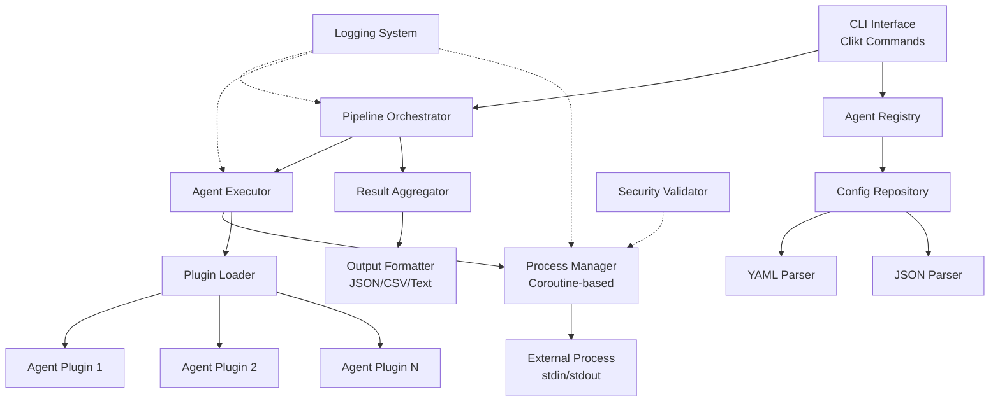
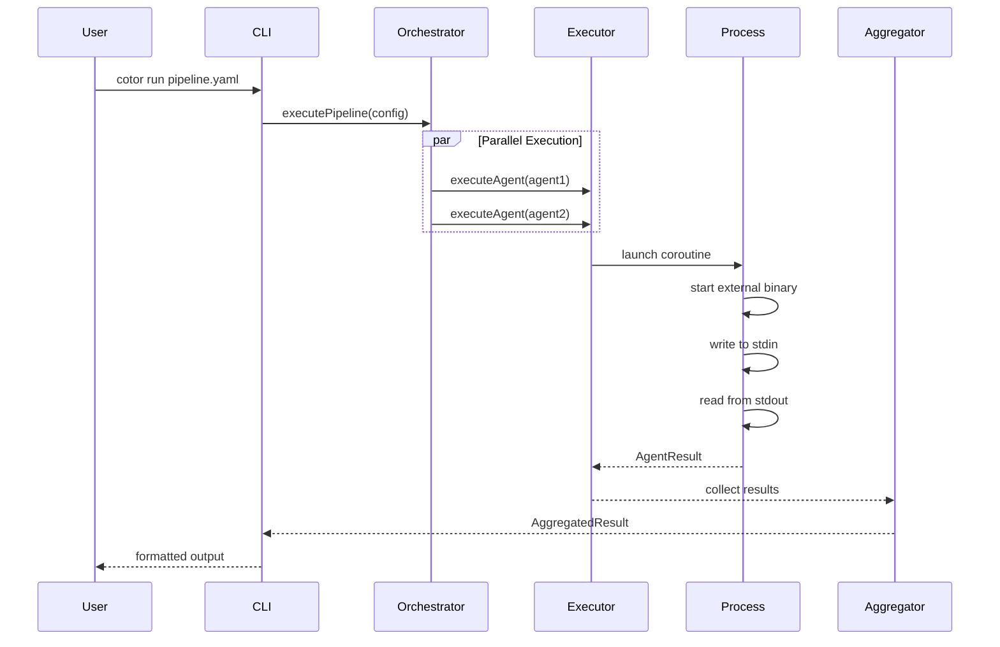

# Design Document

## Overview

Cotor는 Kotlin과 코루틴을 활용한 AI CLI 마스터-에이전트 시스템으로, 여러 독립적인 AI CLI 툴을 통합 관리하고 비동기적으로 실행합니다. 시스템은 계층화된 아키텍처를 따르며, 플러그인 기반의 확장 가능한 설계를 채택합니다.

### 핵심 설계 원칙

1. **비동기 우선 (Async-First)**: 모든 I/O 작업과 에이전트 실행은 Kotlin 코루틴으로 처리
2. **플러그인 아키텍처**: 서브 에이전트를 독립적인 플러그인으로 구현하여 확장성 확보
3. **의존성 역전**: 인터페이스 기반 설계로 컴포넌트 간 결합도 최소화
4. **이벤트 기반 통신**: 컴포넌트 간 비동기 이벤트로 상태 변경 전파
5. **Fail-Safe**: 개별 에이전트 실패가 전체 시스템에 영향을 주지 않도록 격리

### 기술 스택

- **언어**: Kotlin 1.9+ (JVM 17+)
- **비동기 처리**: Kotlinx Coroutines 1.7+
- **CLI 프레임워크**: Clikt 4.0+
- **의존성 주입**: Koin 3.5+
- **설정 파싱**: Kaml (YAML), Kotlinx Serialization (JSON)
- **로깅**: SLF4J + Logback
- **테스트**: Kotest, MockK
- **빌드**: Gradle 8.0+ with Kotlin DSL

## Architecture

### 계층 구조

```
┌─────────────────────────────────────────────────────────┐
│                  Presentation Layer                      │
│  (CLI Interface, Command Handlers, Output Formatters)   │
└─────────────────────────────────────────────────────────┘
                          ↓
┌─────────────────────────────────────────────────────────┐
│                    Domain Layer                          │
│  (Business Logic, Orchestration, Pipeline Management)   │
└─────────────────────────────────────────────────────────┘
                          ↓
┌─────────────────────────────────────────────────────────┐
│                     Data Layer                           │
│  (Agent Registry, Config Repository, Process Executor)  │
└─────────────────────────────────────────────────────────┘
```

### 고수준 아키텍처 다이어그램




### 컴포넌트 간 데이터 흐름



## Components and Interfaces

### 1. Presentation Layer

#### 1.1 CLI Interface (CotorCommand)


**책임**: 사용자 명령을 받아 도메인 레이어로 전달

```kotlin
sealed class CotorCommand : CliktCommand() {
    // 공통 옵션
    val configPath by option("--config", "-c")
        .path(mustExist = true)
        .default(Path("cotor.yaml"))
    
    val logLevel by option("--log-level", "-l")
        .choice("DEBUG", "INFO", "WARN", "ERROR")
        .default("INFO")
    
    val debug by option("--debug", "-d")
        .flag(default = false)
}

class InitCommand : CotorCommand() {
    override fun run() {
        // 기본 설정 파일 생성
    }
}

class RunCommand : CotorCommand() {
    val pipelineName by argument("pipeline")
    val outputFormat by option("--output-format", "-o")
        .choice("json", "csv", "text")
        .default("json")
    
    override fun run() = runBlocking {
        // 파이프라인 실행
    }
}

class StatusCommand : CotorCommand() {
    override fun run() = runBlocking {
        // 실행 중인 에이전트 상태 조회
    }
}

class ListCommand : CotorCommand() {
    override fun run() {
        // 등록된 에이전트 목록 출력
    }
}
```

#### 1.2 Output Formatter

**책임**: 실행 결과를 다양한 형식으로 변환

```kotlin
interface OutputFormatter {
    fun format(result: AggregatedResult): String
}

class JsonOutputFormatter : OutputFormatter {
    private val json = Json { prettyPrint = true }
    
    override fun format(result: AggregatedResult): String {
        return json.encodeToString(result)
    }
}

class CsvOutputFormatter : OutputFormatter {
    override fun format(result: AggregatedResult): String {
        // CSV 형식으로 변환
    }
}

class TextOutputFormatter : OutputFormatter {
    override fun format(result: AggregatedResult): String {
        // 사람이 읽기 쉬운 텍스트 형식
    }
}
```

### 2. Domain Layer

#### 2.1 Pipeline Orchestrator

**책임**: 파이프라인 실행 흐름 제어 및 에이전트 조율


```kotlin
interface PipelineOrchestrator {
    suspend fun executePipeline(pipeline: Pipeline): AggregatedResult
    suspend fun cancelPipeline(pipelineId: String)
    fun getPipelineStatus(pipelineId: String): PipelineStatus
}

class DefaultPipelineOrchestrator(
    private val agentExecutor: AgentExecutor,
    private val resultAggregator: ResultAggregator,
    private val eventBus: EventBus,
    private val logger: Logger
) : PipelineOrchestrator {
    
    private val activePipelines = ConcurrentHashMap<String, Job>()
    
    override suspend fun executePipeline(pipeline: Pipeline): AggregatedResult = coroutineScope {
        val pipelineId = UUID.randomUUID().toString()
        logger.info("Starting pipeline: ${pipeline.name} (ID: $pipelineId)")
        
        val job = launch {
            eventBus.emit(PipelineStartedEvent(pipelineId, pipeline.name))
            
            try {
                val result = when (pipeline.executionMode) {
                    ExecutionMode.SEQUENTIAL -> executeSequential(pipeline)
                    ExecutionMode.PARALLEL -> executeParallel(pipeline)
                    ExecutionMode.DAG -> executeDag(pipeline)
                }
                
                eventBus.emit(PipelineCompletedEvent(pipelineId, result))
                result
            } catch (e: Exception) {
                logger.error("Pipeline failed: ${pipeline.name}", e)
                eventBus.emit(PipelineFailedEvent(pipelineId, e))
                throw e
            } finally {
                activePipelines.remove(pipelineId)
            }
        }
        
        activePipelines[pipelineId] = job
        job.await()
    }
    
    private suspend fun executeSequential(pipeline: Pipeline): AggregatedResult {
        val results = mutableListOf<AgentResult>()
        var previousOutput: String? = null
        
        for (stage in pipeline.stages) {
            val input = previousOutput ?: stage.input
            val result = agentExecutor.executeAgent(stage.agent, input)
            results.add(result)
            
            if (!result.isSuccess && stage.failureStrategy == FailureStrategy.ABORT) {
                break
            }
            
            previousOutput = result.output
        }
        
        return resultAggregator.aggregate(results)
    }
    
    private suspend fun executeParallel(pipeline: Pipeline): AggregatedResult = coroutineScope {
        val results = pipeline.stages.map { stage ->
            async(Dispatchers.Default) {
                agentExecutor.executeAgent(stage.agent, stage.input)
            }
        }.awaitAll()
        
        resultAggregator.aggregate(results)
    }
    
    private suspend fun executeDag(pipeline: Pipeline): AggregatedResult {
        // DAG 기반 실행 (의존성 그래프 해석)
        val graph = buildDependencyGraph(pipeline)
        val results = mutableMapOf<String, AgentResult>()
        
        // 위상 정렬 후 실행
        val sortedStages = topologicalSort(graph)
        
        for (stage in sortedStages) {
            val dependencies = graph.getDependencies(stage)
            val input = resolveDependencies(dependencies, results)
            
            val result = agentExecutor.executeAgent(stage.agent, input)
            results[stage.id] = result
        }
        
        resultAggregator.aggregate(results.values.toList())
    }
    
    override suspend fun cancelPipeline(pipelineId: String) {
        activePipelines[pipelineId]?.cancel()
        logger.info("Pipeline cancelled: $pipelineId")
    }
    
    override fun getPipelineStatus(pipelineId: String): PipelineStatus {
        val job = activePipelines[pipelineId]
        return when {
            job == null -> PipelineStatus.NOT_FOUND
            job.isActive -> PipelineStatus.RUNNING
            job.isCompleted -> PipelineStatus.COMPLETED
            job.isCancelled -> PipelineStatus.CANCELLED
            else -> PipelineStatus.UNKNOWN
        }
    }
}
```

#### 2.2 Agent Executor

**책임**: 개별 에이전트 실행 및 생명주기 관리


```kotlin
interface AgentExecutor {
    suspend fun executeAgent(agent: AgentConfig, input: String?): AgentResult
    suspend fun executeWithRetry(agent: AgentConfig, input: String?, retryPolicy: RetryPolicy): AgentResult
}

class DefaultAgentExecutor(
    private val processManager: ProcessManager,
    private val pluginLoader: PluginLoader,
    private val securityValidator: SecurityValidator,
    private val logger: Logger
) : AgentExecutor {
    
    override suspend fun executeAgent(agent: AgentConfig, input: String?): AgentResult {
        logger.debug("Executing agent: ${agent.name}")
        
        return withContext(Dispatchers.IO) {
            try {
                // 보안 검증
                securityValidator.validate(agent)
                
                // 플러그인 로드
                val plugin = pluginLoader.loadPlugin(agent.pluginClass)
                
                // 실행 컨텍스트 생성
                val context = ExecutionContext(
                    agentName = agent.name,
                    input = input,
                    parameters = agent.parameters,
                    environment = agent.environment,
                    timeout = agent.timeout
                )
                
                // 에이전트 실행
                val startTime = System.currentTimeMillis()
                val output = plugin.execute(context, processManager)
                val duration = System.currentTimeMillis() - startTime
                
                AgentResult(
                    agentName = agent.name,
                    isSuccess = true,
                    output = output,
                    error = null,
                    duration = duration,
                    metadata = mapOf("executedAt" to Instant.now().toString())
                )
                
            } catch (e: TimeoutCancellationException) {
                logger.error("Agent timeout: ${agent.name}", e)
                AgentResult(
                    agentName = agent.name,
                    isSuccess = false,
                    output = null,
                    error = "Execution timeout after ${agent.timeout}ms",
                    duration = agent.timeout,
                    metadata = emptyMap()
                )
            } catch (e: Exception) {
                logger.error("Agent execution failed: ${agent.name}", e)
                AgentResult(
                    agentName = agent.name,
                    isSuccess = false,
                    output = null,
                    error = e.message ?: "Unknown error",
                    duration = 0,
                    metadata = emptyMap()
                )
            }
        }
    }
    
    override suspend fun executeWithRetry(
        agent: AgentConfig,
        input: String?,
        retryPolicy: RetryPolicy
    ): AgentResult {
        var lastResult: AgentResult? = null
        var attempt = 0
        
        while (attempt <= retryPolicy.maxRetries) {
            lastResult = executeAgent(agent, input)
            
            if (lastResult.isSuccess) {
                return lastResult
            }
            
            attempt++
            if (attempt <= retryPolicy.maxRetries) {
                logger.warn("Retry attempt $attempt for agent: ${agent.name}")
                delay(retryPolicy.retryDelay)
            }
        }
        
        return lastResult ?: throw IllegalStateException("No result after retries")
    }
}
```

#### 2.3 Result Aggregator

**책임**: 여러 에이전트 결과를 수집하고 합성

```kotlin
interface ResultAggregator {
    fun aggregate(results: List<AgentResult>): AggregatedResult
}

class DefaultResultAggregator : ResultAggregator {
    override fun aggregate(results: List<AgentResult>): AggregatedResult {
        val successCount = results.count { it.isSuccess }
        val failureCount = results.count { !it.isSuccess }
        val totalDuration = results.sumOf { it.duration }
        
        return AggregatedResult(
            totalAgents = results.size,
            successCount = successCount,
            failureCount = failureCount,
            totalDuration = totalDuration,
            results = results,
            aggregatedOutput = mergeOutputs(results),
            timestamp = Instant.now()
        )
    }
    
    private fun mergeOutputs(results: List<AgentResult>): String {
        return results
            .filter { it.isSuccess && it.output != null }
            .joinToString("\n---\n") { result ->
                "[${result.agentName}]\n${result.output}"
            }
    }
}
```

### 3. Data Layer

#### 3.1 Agent Registry

**책임**: 등록된 에이전트 메타데이터 관리


```kotlin
interface AgentRegistry {
    fun registerAgent(agent: AgentConfig)
    fun unregisterAgent(agentName: String)
    fun getAgent(agentName: String): AgentConfig?
    fun getAllAgents(): List<AgentConfig>
    fun findAgentsByTag(tag: String): List<AgentConfig>
}

class InMemoryAgentRegistry : AgentRegistry {
    private val agents = ConcurrentHashMap<String, AgentConfig>()
    private val tagIndex = ConcurrentHashMap<String, MutableSet<String>>()
    
    override fun registerAgent(agent: AgentConfig) {
        agents[agent.name] = agent
        
        // 태그 인덱싱
        agent.tags.forEach { tag ->
            tagIndex.computeIfAbsent(tag) { ConcurrentHashMap.newKeySet() }
                .add(agent.name)
        }
    }
    
    override fun unregisterAgent(agentName: String) {
        val agent = agents.remove(agentName)
        
        // 태그 인덱스에서 제거
        agent?.tags?.forEach { tag ->
            tagIndex[tag]?.remove(agentName)
        }
    }
    
    override fun getAgent(agentName: String): AgentConfig? {
        return agents[agentName]
    }
    
    override fun getAllAgents(): List<AgentConfig> {
        return agents.values.toList()
    }
    
    override fun findAgentsByTag(tag: String): List<AgentConfig> {
        val agentNames = tagIndex[tag] ?: return emptyList()
        return agentNames.mapNotNull { agents[it] }
    }
}
```

#### 3.2 Config Repository

**책임**: 설정 파일 로드 및 파싱

```kotlin
interface ConfigRepository {
    suspend fun loadConfig(path: Path): CotorConfig
    suspend fun saveConfig(config: CotorConfig, path: Path)
}

class FileConfigRepository(
    private val yamlParser: YamlParser,
    private val jsonParser: JsonParser
) : ConfigRepository {
    
    override suspend fun loadConfig(path: Path): CotorConfig = withContext(Dispatchers.IO) {
        val content = path.readText()
        
        when (path.extension.lowercase()) {
            "yaml", "yml" -> yamlParser.parse(content)
            "json" -> jsonParser.parse(content)
            else -> throw IllegalArgumentException("Unsupported config format: ${path.extension}")
        }
    }
    
    override suspend fun saveConfig(config: CotorConfig, path: Path) = withContext(Dispatchers.IO) {
        val content = when (path.extension.lowercase()) {
            "yaml", "yml" -> yamlParser.serialize(config)
            "json" -> jsonParser.serialize(config)
            else -> throw IllegalArgumentException("Unsupported config format: ${path.extension}")
        }
        
        path.writeText(content)
    }
}

class YamlParser {
    private val yaml = Yaml(configuration = YamlConfiguration(strictMode = false))
    
    fun parse(content: String): CotorConfig {
        return yaml.decodeFromString(CotorConfig.serializer(), content)
    }
    
    fun serialize(config: CotorConfig): String {
        return yaml.encodeToString(CotorConfig.serializer(), config)
    }
}

class JsonParser {
    private val json = Json {
        prettyPrint = true
        ignoreUnknownKeys = true
    }
    
    fun parse(content: String): CotorConfig {
        return json.decodeFromString(CotorConfig.serializer(), content)
    }
    
    fun serialize(config: CotorConfig): String {
        return json.encodeToString(CotorConfig.serializer(), config)
    }
}
```

#### 3.3 Process Manager

**책임**: 외부 프로세스 실행 및 stdin/stdout 통신 (코루틴 기반)


```kotlin
interface ProcessManager {
    suspend fun executeProcess(
        command: List<String>,
        input: String?,
        environment: Map<String, String>,
        timeout: Long
    ): ProcessResult
}

class CoroutineProcessManager(
    private val logger: Logger
) : ProcessManager {
    
    override suspend fun executeProcess(
        command: List<String>,
        input: String?,
        environment: Map<String, String>,
        timeout: Long
    ): ProcessResult = withContext(Dispatchers.IO) {
        
        val processBuilder = ProcessBuilder(command)
            .redirectErrorStream(false)
        
        // 환경 변수 설정
        processBuilder.environment().putAll(environment)
        
        logger.debug("Starting process: ${command.joinToString(" ")}")
        val process = processBuilder.start()
        
        try {
            withTimeout(timeout) {
                // 비동기로 stdin, stdout, stderr 처리
                coroutineScope {
                    // stdin 쓰기
                    val stdinJob = launch {
                        if (input != null) {
                            process.outputStream.bufferedWriter().use { writer ->
                                writer.write(input)
                                writer.flush()
                            }
                        }
                        process.outputStream.close()
                    }
                    
                    // stdout 읽기
                    val stdoutDeferred = async {
                        process.inputStream.bufferedReader().use { reader ->
                            reader.readText()
                        }
                    }
                    
                    // stderr 읽기
                    val stderrDeferred = async {
                        process.errorStream.bufferedReader().use { reader ->
                            reader.readText()
                        }
                    }
                    
                    // 프로세스 종료 대기
                    val exitCodeDeferred = async {
                        process.waitFor()
                    }
                    
                    stdinJob.join()
                    val stdout = stdoutDeferred.await()
                    val stderr = stderrDeferred.await()
                    val exitCode = exitCodeDeferred.await()
                    
                    logger.debug("Process completed with exit code: $exitCode")
                    
                    ProcessResult(
                        exitCode = exitCode,
                        stdout = stdout,
                        stderr = stderr,
                        isSuccess = exitCode == 0
                    )
                }
            }
        } catch (e: TimeoutCancellationException) {
            logger.warn("Process timeout, destroying process")
            process.destroyForcibly()
            throw e
        } catch (e: Exception) {
            logger.error("Process execution failed", e)
            process.destroyForcibly()
            throw e
        }
    }
}
```

#### 3.4 Plugin Loader

**책임**: 에이전트 플러그인 동적 로딩

```kotlin
interface PluginLoader {
    fun loadPlugin(pluginClass: String): AgentPlugin
    fun loadAllPlugins(): List<AgentPlugin>
}

class ReflectionPluginLoader(
    private val logger: Logger
) : PluginLoader {
    
    private val pluginCache = ConcurrentHashMap<String, AgentPlugin>()
    
    override fun loadPlugin(pluginClass: String): AgentPlugin {
        return pluginCache.computeIfAbsent(pluginClass) {
            try {
                val clazz = Class.forName(pluginClass)
                val instance = clazz.getDeclaredConstructor().newInstance()
                
                if (instance !is AgentPlugin) {
                    throw IllegalArgumentException("Class $pluginClass does not implement AgentPlugin")
                }
                
                logger.info("Loaded plugin: $pluginClass")
                instance
            } catch (e: Exception) {
                logger.error("Failed to load plugin: $pluginClass", e)
                throw PluginLoadException("Cannot load plugin: $pluginClass", e)
            }
        }
    }
    
    override fun loadAllPlugins(): List<AgentPlugin> {
        // ServiceLoader를 사용한 자동 발견
        val serviceLoader = ServiceLoader.load(AgentPlugin::class.java)
        return serviceLoader.toList().also { plugins ->
            logger.info("Discovered ${plugins.size} plugins")
            plugins.forEach { plugin ->
                pluginCache[plugin::class.java.name] = plugin
            }
        }
    }
}
```

### 4. Plugin System

#### 4.1 Agent Plugin Interface

**책임**: 서브 에이전트 구현을 위한 표준 인터페이스


```kotlin
interface AgentPlugin {
    val metadata: AgentMetadata
    
    suspend fun execute(context: ExecutionContext, processManager: ProcessManager): String
    
    fun validateInput(input: String?): ValidationResult {
        return ValidationResult.Success
    }
    
    fun supportsFormat(format: DataFormat): Boolean {
        return format == DataFormat.JSON
    }
}

data class AgentMetadata(
    val name: String,
    val version: String,
    val description: String,
    val author: String,
    val supportedFormats: List<DataFormat>,
    val requiredParameters: List<String> = emptyList()
)

data class ExecutionContext(
    val agentName: String,
    val input: String?,
    val parameters: Map<String, String>,
    val environment: Map<String, String>,
    val timeout: Long
)

sealed class ValidationResult {
    object Success : ValidationResult()
    data class Failure(val errors: List<String>) : ValidationResult()
}
```

#### 4.2 Example Plugin Implementation

```kotlin
class NaturalLanguageProcessorPlugin : AgentPlugin {
    
    override val metadata = AgentMetadata(
        name = "nlp-processor",
        version = "1.0.0",
        description = "Natural language processing agent",
        author = "Cotor Team",
        supportedFormats = listOf(DataFormat.JSON, DataFormat.TEXT)
    )
    
    override suspend fun execute(
        context: ExecutionContext,
        processManager: ProcessManager
    ): String {
        val command = listOf(
            "python3",
            "/path/to/nlp_tool.py",
            "--mode", context.parameters["mode"] ?: "analyze"
        )
        
        val result = processManager.executeProcess(
            command = command,
            input = context.input,
            environment = context.environment,
            timeout = context.timeout
        )
        
        if (!result.isSuccess) {
            throw AgentExecutionException("NLP processing failed: ${result.stderr}")
        }
        
        return result.stdout
    }
    
    override fun validateInput(input: String?): ValidationResult {
        if (input.isNullOrBlank()) {
            return ValidationResult.Failure(listOf("Input text is required"))
        }
        
        if (input.length > 10000) {
            return ValidationResult.Failure(listOf("Input text exceeds maximum length of 10000 characters"))
        }
        
        return ValidationResult.Success
    }
}

class CodeGeneratorPlugin : AgentPlugin {
    
    override val metadata = AgentMetadata(
        name = "code-generator",
        version = "1.0.0",
        description = "AI-powered code generation agent",
        author = "Cotor Team",
        supportedFormats = listOf(DataFormat.JSON),
        requiredParameters = listOf("language", "framework")
    )
    
    override suspend fun execute(
        context: ExecutionContext,
        processManager: ProcessManager
    ): String {
        val language = context.parameters["language"]
            ?: throw IllegalArgumentException("Parameter 'language' is required")
        
        val framework = context.parameters["framework"]
            ?: throw IllegalArgumentException("Parameter 'framework' is required")
        
        val command = listOf(
            "node",
            "/path/to/code_generator.js",
            "--language", language,
            "--framework", framework
        )
        
        val result = processManager.executeProcess(
            command = command,
            input = context.input,
            environment = context.environment,
            timeout = context.timeout
        )
        
        if (!result.isSuccess) {
            throw AgentExecutionException("Code generation failed: ${result.stderr}")
        }
        
        return result.stdout
    }
}
```

### 5. Security Components

#### 5.1 Security Validator

**책임**: 명령 실행 전 보안 검증


```kotlin
interface SecurityValidator {
    fun validate(agent: AgentConfig)
    fun validateCommand(command: List<String>)
    fun validatePath(path: Path)
}

class DefaultSecurityValidator(
    private val config: SecurityConfig,
    private val logger: Logger
) : SecurityValidator {
    
    override fun validate(agent: AgentConfig) {
        // 실행 경로 검증
        agent.executablePath?.let { validatePath(it) }
        
        // 환경 변수 검증
        validateEnvironment(agent.environment)
        
        // 파라미터 검증
        validateParameters(agent.parameters)
    }
    
    override fun validateCommand(command: List<String>) {
        if (command.isEmpty()) {
            throw SecurityException("Empty command is not allowed")
        }
        
        val executable = command.first()
        
        // Whitelist 검증
        if (config.useWhitelist && !config.allowedExecutables.contains(executable)) {
            throw SecurityException("Executable not in whitelist: $executable")
        }
        
        // 위험한 명령어 차단
        val dangerousCommands = listOf("rm", "del", "format", "dd", "mkfs")
        if (dangerousCommands.any { executable.endsWith(it) }) {
            logger.warn("Potentially dangerous command detected: $executable")
        }
        
        // 명령 인젝션 패턴 검사
        command.forEach { arg ->
            if (containsInjectionPattern(arg)) {
                throw SecurityException("Command injection pattern detected: $arg")
            }
        }
    }
    
    override fun validatePath(path: Path) {
        val absolutePath = path.toAbsolutePath().normalize()
        
        // 허용된 디렉토리 내부인지 확인
        val isAllowed = config.allowedDirectories.any { allowedDir ->
            absolutePath.startsWith(allowedDir.toAbsolutePath().normalize())
        }
        
        if (!isAllowed) {
            throw SecurityException("Path not in allowed directories: $absolutePath")
        }
        
        // 심볼릭 링크 검증
        if (Files.isSymbolicLink(path)) {
            val target = Files.readSymbolicLink(path)
            validatePath(target)
        }
    }
    
    private fun validateEnvironment(environment: Map<String, String>) {
        val dangerousVars = listOf("LD_PRELOAD", "LD_LIBRARY_PATH", "DYLD_INSERT_LIBRARIES")
        
        environment.keys.forEach { key ->
            if (dangerousVars.contains(key)) {
                throw SecurityException("Dangerous environment variable: $key")
            }
        }
    }
    
    private fun validateParameters(parameters: Map<String, String>) {
        parameters.values.forEach { value ->
            if (containsInjectionPattern(value)) {
                throw SecurityException("Injection pattern in parameter: $value")
            }
        }
    }
    
    private fun containsInjectionPattern(input: String): Boolean {
        val injectionPatterns = listOf(
            ";", "&&", "||", "|", "`", "$(",
            "../", "..\\", "<", ">", "\n", "\r"
        )
        
        return injectionPatterns.any { pattern ->
            input.contains(pattern)
        }
    }
}

data class SecurityConfig(
    val useWhitelist: Boolean = true,
    val allowedExecutables: Set<String> = emptySet(),
    val allowedDirectories: List<Path> = emptyList(),
    val maxCommandLength: Int = 1000,
    val enablePathValidation: Boolean = true
)
```

### 6. Event System

#### 6.1 Event Bus

**책임**: 컴포넌트 간 비동기 이벤트 전파

```kotlin
interface EventBus {
    suspend fun emit(event: CotorEvent)
    fun subscribe(eventType: KClass<out CotorEvent>, handler: suspend (CotorEvent) -> Unit)
    fun unsubscribe(eventType: KClass<out CotorEvent>)
}

class CoroutineEventBus : EventBus {
    private val subscribers = ConcurrentHashMap<KClass<out CotorEvent>, MutableList<suspend (CotorEvent) -> Unit>>()
    private val eventChannel = Channel<CotorEvent>(Channel.UNLIMITED)
    
    init {
        // 이벤트 처리 코루틴 시작
        GlobalScope.launch {
            for (event in eventChannel) {
                processEvent(event)
            }
        }
    }
    
    override suspend fun emit(event: CotorEvent) {
        eventChannel.send(event)
    }
    
    override fun subscribe(eventType: KClass<out CotorEvent>, handler: suspend (CotorEvent) -> Unit) {
        subscribers.computeIfAbsent(eventType) { mutableListOf() }
            .add(handler)
    }
    
    override fun unsubscribe(eventType: KClass<out CotorEvent>) {
        subscribers.remove(eventType)
    }
    
    private suspend fun processEvent(event: CotorEvent) = coroutineScope {
        val handlers = subscribers[event::class] ?: return@coroutineScope
        
        handlers.forEach { handler ->
            launch {
                try {
                    handler(event)
                } catch (e: Exception) {
                    // 로그 기록
                }
            }
        }
    }
}
```

#### 6.2 Event Types


```kotlin
sealed class CotorEvent {
    abstract val timestamp: Instant
}

data class PipelineStartedEvent(
    val pipelineId: String,
    val pipelineName: String,
    override val timestamp: Instant = Instant.now()
) : CotorEvent()

data class PipelineCompletedEvent(
    val pipelineId: String,
    val result: AggregatedResult,
    override val timestamp: Instant = Instant.now()
) : CotorEvent()

data class PipelineFailedEvent(
    val pipelineId: String,
    val error: Throwable,
    override val timestamp: Instant = Instant.now()
) : CotorEvent()

data class AgentStartedEvent(
    val agentName: String,
    val pipelineId: String?,
    override val timestamp: Instant = Instant.now()
) : CotorEvent()

data class AgentCompletedEvent(
    val agentName: String,
    val result: AgentResult,
    override val timestamp: Instant = Instant.now()
) : CotorEvent()

data class AgentFailedEvent(
    val agentName: String,
    val error: String,
    override val timestamp: Instant = Instant.now()
) : CotorEvent()
```

## Data Models

### Core Domain Models

```kotlin
@Serializable
data class CotorConfig(
    val version: String = "1.0",
    val agents: List<AgentConfig> = emptyList(),
    val pipelines: List<Pipeline> = emptyList(),
    val security: SecurityConfig = SecurityConfig(),
    val logging: LoggingConfig = LoggingConfig(),
    val performance: PerformanceConfig = PerformanceConfig()
)

@Serializable
data class AgentConfig(
    val name: String,
    val pluginClass: String,
    val executablePath: Path? = null,
    val parameters: Map<String, String> = emptyMap(),
    val environment: Map<String, String> = emptyMap(),
    val timeout: Long = 30000, // 30초
    val retryPolicy: RetryPolicy = RetryPolicy(),
    val tags: List<String> = emptyList(),
    val inputFormat: DataFormat = DataFormat.JSON,
    val outputFormat: DataFormat = DataFormat.JSON
)

@Serializable
data class Pipeline(
    val name: String,
    val description: String = "",
    val executionMode: ExecutionMode = ExecutionMode.SEQUENTIAL,
    val stages: List<PipelineStage> = emptyList(),
    val failureStrategy: FailureStrategy = FailureStrategy.ABORT
)

@Serializable
data class PipelineStage(
    val id: String,
    val agent: AgentConfig,
    val input: String? = null,
    val dependencies: List<String> = emptyList(),
    val failureStrategy: FailureStrategy = FailureStrategy.ABORT
)

@Serializable
enum class ExecutionMode {
    SEQUENTIAL,  // 순차 실행
    PARALLEL,    // 병렬 실행
    DAG          // 의존성 그래프 기반 실행
}

@Serializable
enum class FailureStrategy {
    ABORT,       // 즉시 중단
    CONTINUE,    // 계속 진행
    RETRY,       // 재시도
    FALLBACK     // Fallback 실행
}

@Serializable
data class RetryPolicy(
    val maxRetries: Int = 3,
    val retryDelay: Long = 1000, // 1초
    val backoffMultiplier: Double = 2.0
)

@Serializable
enum class DataFormat {
    JSON,
    CSV,
    TEXT,
    PROTOBUF,
    XML
}

data class AgentResult(
    val agentName: String,
    val isSuccess: Boolean,
    val output: String?,
    val error: String?,
    val duration: Long,
    val metadata: Map<String, String>
)

data class AggregatedResult(
    val totalAgents: Int,
    val successCount: Int,
    val failureCount: Int,
    val totalDuration: Long,
    val results: List<AgentResult>,
    val aggregatedOutput: String,
    val timestamp: Instant
)

data class ProcessResult(
    val exitCode: Int,
    val stdout: String,
    val stderr: String,
    val isSuccess: Boolean
)

enum class PipelineStatus {
    NOT_FOUND,
    RUNNING,
    COMPLETED,
    CANCELLED,
    UNKNOWN
}

@Serializable
data class LoggingConfig(
    val level: String = "INFO",
    val file: String = "cotor.log",
    val maxFileSize: String = "10MB",
    val maxHistory: Int = 7,
    val format: String = "json"
)

@Serializable
data class PerformanceConfig(
    val maxConcurrentAgents: Int = 10,
    val coroutinePoolSize: Int = Runtime.getRuntime().availableProcessors(),
    val memoryThresholdMB: Int = 1024
)
```

## Error Handling

### Exception Hierarchy


```kotlin
sealed class CotorException(message: String, cause: Throwable? = null) : Exception(message, cause)

class ConfigurationException(message: String, cause: Throwable? = null) : CotorException(message, cause)

class PluginLoadException(message: String, cause: Throwable? = null) : CotorException(message, cause)

class AgentExecutionException(message: String, cause: Throwable? = null) : CotorException(message, cause)

class SecurityException(message: String, cause: Throwable? = null) : CotorException(message, cause)

class PipelineException(message: String, cause: Throwable? = null) : CotorException(message, cause)

class ValidationException(message: String, val errors: List<String>) : CotorException(message)
```

### Error Recovery Strategies

```kotlin
class ErrorRecoveryManager(
    private val logger: Logger
) {
    suspend fun <T> executeWithRecovery(
        operation: suspend () -> T,
        fallback: (suspend (Throwable) -> T)? = null,
        retryPolicy: RetryPolicy = RetryPolicy()
    ): T {
        var lastException: Throwable? = null
        var attempt = 0
        
        while (attempt <= retryPolicy.maxRetries) {
            try {
                return operation()
            } catch (e: Exception) {
                lastException = e
                logger.warn("Operation failed (attempt ${attempt + 1}/${retryPolicy.maxRetries + 1})", e)
                
                if (attempt < retryPolicy.maxRetries) {
                    val delayMs = (retryPolicy.retryDelay * retryPolicy.backoffMultiplier.pow(attempt)).toLong()
                    delay(delayMs)
                }
                
                attempt++
            }
        }
        
        // 모든 재시도 실패 시 fallback 실행
        if (fallback != null && lastException != null) {
            logger.info("Executing fallback strategy")
            return fallback(lastException)
        }
        
        throw lastException ?: IllegalStateException("Operation failed without exception")
    }
}
```

## Testing Strategy

### Unit Testing

```kotlin
class AgentExecutorTest : FunSpec({
    
    val mockProcessManager = mockk<ProcessManager>()
    val mockPluginLoader = mockk<PluginLoader>()
    val mockSecurityValidator = mockk<SecurityValidator>()
    val mockLogger = mockk<Logger>(relaxed = true)
    
    val executor = DefaultAgentExecutor(
        mockProcessManager,
        mockPluginLoader,
        mockSecurityValidator,
        mockLogger
    )
    
    test("should execute agent successfully") {
        // Given
        val agentConfig = AgentConfig(
            name = "test-agent",
            pluginClass = "com.example.TestPlugin",
            timeout = 5000
        )
        
        val mockPlugin = mockk<AgentPlugin>()
        coEvery { mockPlugin.execute(any(), any()) } returns "success output"
        every { mockPluginLoader.loadPlugin(any()) } returns mockPlugin
        every { mockSecurityValidator.validate(any()) } just Runs
        
        // When
        val result = runBlocking {
            executor.executeAgent(agentConfig, "test input")
        }
        
        // Then
        result.isSuccess shouldBe true
        result.output shouldBe "success output"
        result.agentName shouldBe "test-agent"
    }
    
    test("should handle agent timeout") {
        // Given
        val agentConfig = AgentConfig(
            name = "slow-agent",
            pluginClass = "com.example.SlowPlugin",
            timeout = 100
        )
        
        val mockPlugin = mockk<AgentPlugin>()
        coEvery { mockPlugin.execute(any(), any()) } coAnswers {
            delay(1000)
            "never returned"
        }
        every { mockPluginLoader.loadPlugin(any()) } returns mockPlugin
        every { mockSecurityValidator.validate(any()) } just Runs
        
        // When
        val result = runBlocking {
            executor.executeAgent(agentConfig, null)
        }
        
        // Then
        result.isSuccess shouldBe false
        result.error shouldContain "timeout"
    }
})
```

### Integration Testing

```kotlin
class PipelineIntegrationTest : FunSpec({
    
    lateinit var orchestrator: PipelineOrchestrator
    lateinit var tempConfigFile: Path
    
    beforeTest {
        // 테스트 환경 설정
        val koinModule = module {
            single<ProcessManager> { CoroutineProcessManager(get()) }
            single<AgentExecutor> { DefaultAgentExecutor(get(), get(), get(), get()) }
            single<ResultAggregator> { DefaultResultAggregator() }
            single<EventBus> { CoroutineEventBus() }
            single<Logger> { LoggerFactory.getLogger("test") }
        }
        
        startKoin { modules(koinModule) }
        orchestrator = get()
        
        // 테스트 설정 파일 생성
        tempConfigFile = Files.createTempFile("cotor-test", ".yaml")
    }
    
    afterTest {
        stopKoin()
        Files.deleteIfExists(tempConfigFile)
    }
    
    test("should execute sequential pipeline") {
        // Given
        val pipeline = Pipeline(
            name = "test-pipeline",
            executionMode = ExecutionMode.SEQUENTIAL,
            stages = listOf(
                PipelineStage(
                    id = "stage1",
                    agent = AgentConfig(
                        name = "echo-agent",
                        pluginClass = "com.example.EchoPlugin"
                    ),
                    input = "hello"
                ),
                PipelineStage(
                    id = "stage2",
                    agent = AgentConfig(
                        name = "uppercase-agent",
                        pluginClass = "com.example.UppercasePlugin"
                    )
                )
            )
        )
        
        // When
        val result = runBlocking {
            orchestrator.executePipeline(pipeline)
        }
        
        // Then
        result.successCount shouldBe 2
        result.failureCount shouldBe 0
    }
})
```

### End-to-End Testing


```kotlin
class EndToEndTest : FunSpec({
    
    test("should execute complete workflow from CLI to output") {
        // Given: 실제 설정 파일 생성
        val configContent = """
            version: "1.0"
            agents:
              - name: nlp-agent
                pluginClass: com.cotor.plugins.NlpPlugin
                timeout: 10000
            pipelines:
              - name: text-analysis
                executionMode: SEQUENTIAL
                stages:
                  - id: analyze
                    agent:
                      name: nlp-agent
                      pluginClass: com.cotor.plugins.NlpPlugin
                    input: "This is a test sentence."
        """.trimIndent()
        
        val configFile = Files.createTempFile("e2e-test", ".yaml")
        configFile.writeText(configContent)
        
        // When: CLI 명령 실행
        val exitCode = runCli(arrayOf(
            "run",
            "text-analysis",
            "--config", configFile.toString(),
            "--output-format", "json"
        ))
        
        // Then
        exitCode shouldBe 0
    }
})

fun runCli(args: Array<String>): Int {
    return try {
        CotorCommand().main(args)
        0
    } catch (e: Exception) {
        1
    }
}
```

## Dependency Injection Setup

### Koin Module Configuration

```kotlin
val cotorModule = module {
    
    // Data Layer
    single<AgentRegistry> { InMemoryAgentRegistry() }
    single<ConfigRepository> { FileConfigRepository(get(), get()) }
    single<YamlParser> { YamlParser() }
    single<JsonParser> { JsonParser() }
    single<ProcessManager> { CoroutineProcessManager(get()) }
    single<PluginLoader> { ReflectionPluginLoader(get()) }
    
    // Domain Layer
    single<AgentExecutor> { DefaultAgentExecutor(get(), get(), get(), get()) }
    single<PipelineOrchestrator> { DefaultPipelineOrchestrator(get(), get(), get(), get()) }
    single<ResultAggregator> { DefaultResultAggregator() }
    single<ErrorRecoveryManager> { ErrorRecoveryManager(get()) }
    
    // Security
    single<SecurityValidator> { DefaultSecurityValidator(get(), get()) }
    single<SecurityConfig> {
        SecurityConfig(
            useWhitelist = true,
            allowedExecutables = setOf("python3", "node", "java"),
            allowedDirectories = listOf(Path.of("/usr/local/bin"), Path.of("/opt/cotor"))
        )
    }
    
    // Event System
    single<EventBus> { CoroutineEventBus() }
    
    // Presentation Layer
    factory<OutputFormatter> { (format: String) ->
        when (format) {
            "json" -> JsonOutputFormatter()
            "csv" -> CsvOutputFormatter()
            "text" -> TextOutputFormatter()
            else -> JsonOutputFormatter()
        }
    }
    
    // Logging
    single<Logger> { LoggerFactory.getLogger("Cotor") }
}

// Application 초기화
fun initializeCotor() {
    startKoin {
        modules(cotorModule)
    }
}
```

## Performance Optimization

### Coroutine Dispatcher Configuration

```kotlin
object CotorDispatchers {
    // I/O 작업용 (파일, 네트워크, 프로세스 실행)
    val IO = Dispatchers.IO.limitedParallelism(64)
    
    // CPU 집약적 작업용 (데이터 변환, 파싱)
    val Compute = Dispatchers.Default
    
    // 메인 스레드 (CLI 출력)
    val Main = Dispatchers.Main
    
    // 커스텀 디스패처 (에이전트 실행 전용)
    val AgentExecution = Executors.newFixedThreadPool(
        Runtime.getRuntime().availableProcessors() * 2
    ).asCoroutineDispatcher()
}
```

### Resource Management

```kotlin
class ResourceMonitor(
    private val config: PerformanceConfig,
    private val logger: Logger
) {
    private val runtime = Runtime.getRuntime()
    
    fun checkMemoryUsage(): MemoryStatus {
        val usedMemoryMB = (runtime.totalMemory() - runtime.freeMemory()) / (1024 * 1024)
        val maxMemoryMB = runtime.maxMemory() / (1024 * 1024)
        val usagePercent = (usedMemoryMB.toDouble() / maxMemoryMB * 100).toInt()
        
        return when {
            usagePercent > 90 -> {
                logger.warn("Critical memory usage: $usagePercent%")
                MemoryStatus.CRITICAL
            }
            usagePercent > 75 -> {
                logger.warn("High memory usage: $usagePercent%")
                MemoryStatus.HIGH
            }
            else -> MemoryStatus.NORMAL
        }
    }
    
    suspend fun enforceResourceLimits(activeAgents: Int) {
        if (activeAgents >= config.maxConcurrentAgents) {
            logger.info("Max concurrent agents reached, waiting...")
            delay(1000)
        }
        
        val memoryStatus = checkMemoryUsage()
        if (memoryStatus == MemoryStatus.CRITICAL) {
            System.gc()
            delay(500)
        }
    }
}

enum class MemoryStatus {
    NORMAL, HIGH, CRITICAL
}
```

## Logging and Monitoring

### Structured Logging

```kotlin
class StructuredLogger(
    private val logger: Logger
) {
    fun logAgentExecution(
        agentName: String,
        duration: Long,
        success: Boolean,
        additionalContext: Map<String, Any> = emptyMap()
    ) {
        val logData = mapOf(
            "event" to "agent_execution",
            "agent_name" to agentName,
            "duration_ms" to duration,
            "success" to success,
            "timestamp" to Instant.now().toString()
        ) + additionalContext
        
        val jsonLog = Json.encodeToString(logData)
        
        if (success) {
            logger.info(jsonLog)
        } else {
            logger.error(jsonLog)
        }
    }
    
    fun logPipelineExecution(
        pipelineName: String,
        totalDuration: Long,
        successCount: Int,
        failureCount: Int
    ) {
        val logData = mapOf(
            "event" to "pipeline_execution",
            "pipeline_name" to pipelineName,
            "total_duration_ms" to totalDuration,
            "success_count" to successCount,
            "failure_count" to failureCount,
            "timestamp" to Instant.now().toString()
        )
        
        logger.info(Json.encodeToString(logData))
    }
}
```

### Metrics Collection


```kotlin
class MetricsCollector {
    private val agentExecutionTimes = ConcurrentHashMap<String, MutableList<Long>>()
    private val agentSuccessRates = ConcurrentHashMap<String, AtomicInteger>()
    private val agentFailureRates = ConcurrentHashMap<String, AtomicInteger>()
    
    fun recordExecution(agentName: String, duration: Long, success: Boolean) {
        agentExecutionTimes.computeIfAbsent(agentName) { mutableListOf() }
            .add(duration)
        
        if (success) {
            agentSuccessRates.computeIfAbsent(agentName) { AtomicInteger(0) }
                .incrementAndGet()
        } else {
            agentFailureRates.computeIfAbsent(agentName) { AtomicInteger(0) }
                .incrementAndGet()
        }
    }
    
    fun getMetrics(agentName: String): AgentMetrics {
        val executionTimes = agentExecutionTimes[agentName] ?: emptyList()
        val successCount = agentSuccessRates[agentName]?.get() ?: 0
        val failureCount = agentFailureRates[agentName]?.get() ?: 0
        
        return AgentMetrics(
            agentName = agentName,
            totalExecutions = successCount + failureCount,
            successCount = successCount,
            failureCount = failureCount,
            averageDuration = if (executionTimes.isNotEmpty()) executionTimes.average() else 0.0,
            minDuration = executionTimes.minOrNull() ?: 0,
            maxDuration = executionTimes.maxOrNull() ?: 0
        )
    }
    
    fun getAllMetrics(): Map<String, AgentMetrics> {
        return agentExecutionTimes.keys.associateWith { getMetrics(it) }
    }
}

data class AgentMetrics(
    val agentName: String,
    val totalExecutions: Int,
    val successCount: Int,
    val failureCount: Int,
    val averageDuration: Double,
    val minDuration: Long,
    val maxDuration: Long
) {
    val successRate: Double
        get() = if (totalExecutions > 0) successCount.toDouble() / totalExecutions * 100 else 0.0
}
```

## Configuration Examples

### Example cotor.yaml

```yaml
version: "1.0"

# 에이전트 정의
agents:
  - name: nlp-processor
    pluginClass: com.cotor.plugins.NlpProcessorPlugin
    executablePath: /usr/local/bin/python3
    parameters:
      mode: analyze
      language: en
    environment:
      PYTHONPATH: /opt/nlp-tools
    timeout: 30000
    retryPolicy:
      maxRetries: 3
      retryDelay: 1000
      backoffMultiplier: 2.0
    tags:
      - nlp
      - text-processing
    inputFormat: TEXT
    outputFormat: JSON

  - name: code-generator
    pluginClass: com.cotor.plugins.CodeGeneratorPlugin
    executablePath: /usr/local/bin/node
    parameters:
      language: kotlin
      framework: spring-boot
    timeout: 60000
    tags:
      - code-generation
      - ai
    inputFormat: JSON
    outputFormat: TEXT

  - name: data-analyzer
    pluginClass: com.cotor.plugins.DataAnalyzerPlugin
    executablePath: /usr/local/bin/python3
    parameters:
      analysis_type: statistical
    timeout: 45000
    tags:
      - data-analysis
      - statistics

# 파이프라인 정의
pipelines:
  - name: text-to-code
    description: "자연어 설명을 코드로 변환하는 파이프라인"
    executionMode: SEQUENTIAL
    failureStrategy: ABORT
    stages:
      - id: understand
        agent:
          name: nlp-processor
          pluginClass: com.cotor.plugins.NlpProcessorPlugin
          parameters:
            mode: understand
        input: "Create a REST API for user management"
        failureStrategy: RETRY

      - id: generate
        agent:
          name: code-generator
          pluginClass: com.cotor.plugins.CodeGeneratorPlugin
          parameters:
            language: kotlin
            framework: spring-boot
        dependencies:
          - understand
        failureStrategy: ABORT

  - name: parallel-analysis
    description: "여러 분석 도구를 병렬로 실행"
    executionMode: PARALLEL
    stages:
      - id: nlp-analysis
        agent:
          name: nlp-processor
          pluginClass: com.cotor.plugins.NlpProcessorPlugin
        input: "Sample text for analysis"

      - id: data-analysis
        agent:
          name: data-analyzer
          pluginClass: com.cotor.plugins.DataAnalyzerPlugin
        input: "1,2,3,4,5"

  - name: dag-workflow
    description: "복잡한 의존성 그래프 기반 워크플로우"
    executionMode: DAG
    stages:
      - id: step1
        agent:
          name: nlp-processor
          pluginClass: com.cotor.plugins.NlpProcessorPlugin
        input: "Initial input"

      - id: step2a
        agent:
          name: data-analyzer
          pluginClass: com.cotor.plugins.DataAnalyzerPlugin
        dependencies:
          - step1

      - id: step2b
        agent:
          name: code-generator
          pluginClass: com.cotor.plugins.CodeGeneratorPlugin
        dependencies:
          - step1

      - id: step3
        agent:
          name: nlp-processor
          pluginClass: com.cotor.plugins.NlpProcessorPlugin
        dependencies:
          - step2a
          - step2b

# 보안 설정
security:
  useWhitelist: true
  allowedExecutables:
    - python3
    - node
    - java
    - /usr/local/bin/custom-tool
  allowedDirectories:
    - /usr/local/bin
    - /opt/cotor
    - /home/user/cotor-agents
  maxCommandLength: 1000
  enablePathValidation: true

# 로깅 설정
logging:
  level: INFO
  file: cotor.log
  maxFileSize: 10MB
  maxHistory: 7
  format: json

# 성능 설정
performance:
  maxConcurrentAgents: 10
  coroutinePoolSize: 8
  memoryThresholdMB: 1024
```

### Example JSON Configuration

```json
{
  "version": "1.0",
  "agents": [
    {
      "name": "nlp-processor",
      "pluginClass": "com.cotor.plugins.NlpProcessorPlugin",
      "executablePath": "/usr/local/bin/python3",
      "parameters": {
        "mode": "analyze",
        "language": "en"
      },
      "timeout": 30000,
      "tags": ["nlp", "text-processing"]
    }
  ],
  "pipelines": [
    {
      "name": "simple-pipeline",
      "executionMode": "SEQUENTIAL",
      "stages": [
        {
          "id": "process",
          "agent": {
            "name": "nlp-processor",
            "pluginClass": "com.cotor.plugins.NlpProcessorPlugin"
          },
          "input": "Test input"
        }
      ]
    }
  ]
}
```

## Deployment and Build

### Gradle Build Configuration

```kotlin
// build.gradle.kts
plugins {
    kotlin("jvm") version "1.9.20"
    kotlin("plugin.serialization") version "1.9.20"
    application
    id("com.github.johnrengelman.shadow") version "8.1.1"
}

group = "com.cotor"
version = "1.0.0"

repositories {
    mavenCentral()
}

dependencies {
    // Kotlin
    implementation(kotlin("stdlib"))
    implementation("org.jetbrains.kotlinx:kotlinx-coroutines-core:1.7.3")
    
    // CLI
    implementation("com.github.ajalt.clikt:clikt:4.2.1")
    
    // Serialization
    implementation("org.jetbrains.kotlinx:kotlinx-serialization-json:1.6.0")
    implementation("com.charleskorn.kaml:kaml:0.55.0")
    
    // Dependency Injection
    implementation("io.insert-koin:koin-core:3.5.0")
    
    // Logging
    implementation("org.slf4j:slf4j-api:2.0.9")
    implementation("ch.qos.logback:logback-classic:1.4.11")
    
    // Testing
    testImplementation("io.kotest:kotest-runner-junit5:5.8.0")
    testImplementation("io.kotest:kotest-assertions-core:5.8.0")
    testImplementation("io.mockk:mockk:1.13.8")
    testImplementation("org.jetbrains.kotlinx:kotlinx-coroutines-test:1.7.3")
}

application {
    mainClass.set("com.cotor.MainKt")
}

tasks.test {
    useJUnitPlatform()
}

tasks.shadowJar {
    archiveBaseName.set("cotor")
    archiveClassifier.set("")
    archiveVersion.set(version.toString())
}
```

### Main Entry Point


```kotlin
// Main.kt
package com.cotor

import com.github.ajalt.clikt.core.CliktCommand
import com.github.ajalt.clikt.core.subcommands
import org.koin.core.context.startKoin
import org.koin.core.context.stopKoin

fun main(args: Array<String>) {
    // Koin 초기화
    startKoin {
        modules(cotorModule)
    }
    
    try {
        // CLI 실행
        CotorCli()
            .subcommands(
                InitCommand(),
                RunCommand(),
                StatusCommand(),
                ListCommand(),
                VersionCommand()
            )
            .main(args)
    } finally {
        // 정리
        stopKoin()
    }
}

class CotorCli : CliktCommand(
    name = "cotor",
    help = "AI CLI Master-Agent System"
) {
    override fun run() {
        // 서브커맨드가 없으면 도움말 출력
        echo(getFormattedHelp())
    }
}

class VersionCommand : CliktCommand(
    name = "version",
    help = "Show version information"
) {
    override fun run() {
        echo("Cotor version 1.0.0")
        echo("Kotlin ${KotlinVersion.CURRENT}")
        echo("JVM ${System.getProperty("java.version")}")
    }
}
```

## Future Extensibility

### API Layer for Web/GUI Integration

```kotlin
// 향후 웹/GUI 확장을 위한 API 레이어
interface CotorApi {
    suspend fun executePipeline(pipelineName: String, input: String?): AggregatedResult
    suspend fun getAgentList(): List<AgentConfig>
    suspend fun getPipelineStatus(pipelineId: String): PipelineStatus
    suspend fun cancelPipeline(pipelineId: String)
    suspend fun getMetrics(): Map<String, AgentMetrics>
}

class CotorApiImpl(
    private val orchestrator: PipelineOrchestrator,
    private val registry: AgentRegistry,
    private val metricsCollector: MetricsCollector
) : CotorApi {
    
    override suspend fun executePipeline(pipelineName: String, input: String?): AggregatedResult {
        // 파이프라인 조회 및 실행
        TODO("Implementation for API layer")
    }
    
    override suspend fun getAgentList(): List<AgentConfig> {
        return registry.getAllAgents()
    }
    
    override suspend fun getPipelineStatus(pipelineId: String): PipelineStatus {
        return orchestrator.getPipelineStatus(pipelineId)
    }
    
    override suspend fun cancelPipeline(pipelineId: String) {
        orchestrator.cancelPipeline(pipelineId)
    }
    
    override suspend fun getMetrics(): Map<String, AgentMetrics> {
        return metricsCollector.getAllMetrics()
    }
}
```

### Plugin Discovery via ServiceLoader

```kotlin
// META-INF/services/com.cotor.plugin.AgentPlugin 파일에 플러그인 클래스 등록
// 예: com.example.MyCustomPlugin

class PluginDiscoveryService {
    fun discoverPlugins(): List<AgentPlugin> {
        val serviceLoader = ServiceLoader.load(AgentPlugin::class.java)
        return serviceLoader.toList()
    }
}
```

### Remote Agent Execution (향후 확장)

```kotlin
// 원격 에이전트 실행을 위한 인터페이스
interface RemoteAgentExecutor {
    suspend fun executeRemote(
        endpoint: String,
        agent: AgentConfig,
        input: String?
    ): AgentResult
}

class HttpRemoteAgentExecutor(
    private val httpClient: HttpClient
) : RemoteAgentExecutor {
    
    override suspend fun executeRemote(
        endpoint: String,
        agent: AgentConfig,
        input: String?
    ): AgentResult {
        // HTTP API를 통한 원격 에이전트 실행
        TODO("Implementation for remote execution")
    }
}
```

## Design Decisions and Rationales

### 1. Kotlin 코루틴 선택 이유

- **비동기 처리의 간결성**: async/await 패턴으로 복잡한 비동기 로직을 동기 코드처럼 작성
- **구조화된 동시성**: coroutineScope를 통한 자동 리소스 관리 및 취소 전파
- **성능**: 경량 스레드로 수천 개의 동시 작업 처리 가능
- **JVM 생태계 통합**: 기존 Java 라이브러리와 완벽한 호환성

### 2. 플러그인 아키텍처 선택 이유

- **확장성**: 새로운 AI 툴을 코어 시스템 수정 없이 추가 가능
- **격리**: 각 플러그인의 실패가 다른 플러그인에 영향을 주지 않음
- **유연성**: 다양한 언어와 프레임워크로 작성된 툴 통합 가능
- **테스트 용이성**: 플러그인을 독립적으로 테스트 가능

### 3. 이벤트 기반 아키텍처 선택 이유

- **느슨한 결합**: 컴포넌트 간 직접 의존성 제거
- **확장성**: 새로운 이벤트 핸들러를 쉽게 추가 가능
- **모니터링**: 시스템 전체의 상태 변화를 중앙에서 추적
- **비동기 처리**: 이벤트 처리가 메인 실행 흐름을 차단하지 않음

### 4. 계층화된 아키텍처 선택 이유

- **관심사 분리**: 각 레이어가 명확한 책임을 가짐
- **테스트 용이성**: 각 레이어를 독립적으로 테스트 가능
- **유지보수성**: 변경 사항이 특정 레이어에 국한됨
- **재사용성**: 도메인 로직을 다양한 인터페이스(CLI, API)에서 재사용

### 5. 보안 우선 설계

- **Whitelist 기반 접근**: 명시적으로 허용된 실행 파일만 실행
- **입력 검증**: 모든 외부 입력에 대한 엄격한 검증
- **경로 정규화**: 심볼릭 링크 공격 방지
- **환경 변수 격리**: 위험한 환경 변수 차단

## Summary

Cotor 시스템은 Kotlin과 코루틴을 활용한 현대적인 AI CLI 마스터-에이전트 시스템으로, 다음과 같은 핵심 특징을 가집니다:

1. **비동기 우선 설계**: 모든 I/O 작업과 에이전트 실행을 코루틴으로 처리하여 높은 동시성과 성능 제공
2. **플러그인 기반 확장성**: 새로운 AI 툴을 쉽게 통합할 수 있는 유연한 플러그인 시스템
3. **강력한 오케스트레이션**: 순차, 병렬, DAG 기반 실행 모드를 지원하는 파이프라인 엔진
4. **보안 중심**: Whitelist 기반 실행 제어와 입력 검증으로 안전한 외부 프로세스 실행
5. **관찰 가능성**: 구조화된 로깅, 메트릭 수집, 이벤트 기반 모니터링
6. **테스트 가능성**: 계층화된 아키텍처와 의존성 주입으로 높은 테스트 커버리지 달성
7. **미래 확장성**: API 레이어를 통한 웹/GUI 통합 준비

이 설계는 요구사항 문서의 모든 항목을 충족하며, 확장 가능하고 유지보수 가능한 시스템을 제공합니다.
