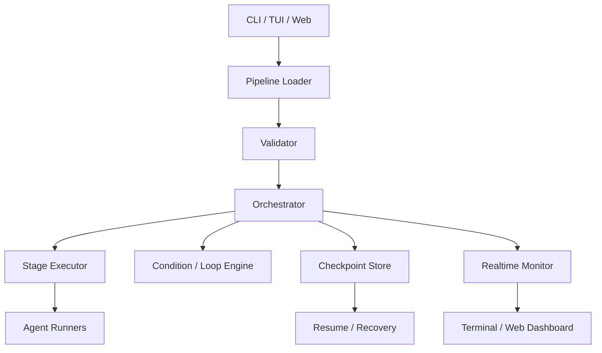
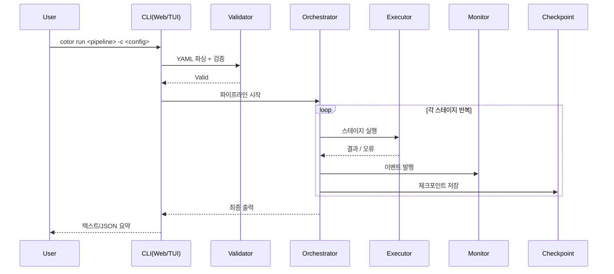

# Cotor 아키텍처

원문: [ARCHITECTURE.md](ARCHITECTURE.md)

Cotor는 **설정 기반 파이프라인 오케스트레이터**입니다. 현재 코드 기준 핵심 흐름은 아래와 같습니다.

`설정 로드 → 검증 → 오케스트레이션 → 모니터링/체크포인트 → 출력`

## 1) 상위 구성 요소

## 2) 런타임 흐름

## 3) 코드 기준 모듈 맵

- `src/main/kotlin/com/cotor/domain/`
  - orchestrator, executor, condition 엔진
- `src/main/kotlin/com/cotor/presentation/`
  - CLI, web, formatter
- `src/main/kotlin/com/cotor/monitoring/`
  - 런타임 이벤트와 모니터링
- `src/main/kotlin/com/cotor/checkpoint/`
  - 체크포인트 저장과 조회
- `src/main/kotlin/com/cotor/validation/`
  - 파이프라인과 설정 검증

## 4) 왜 이렇게 나뉘는가

- **관심사 분리**
  - 파싱, 검증, 실행, 표시를 분리해 변경 영향 범위를 줄입니다.
- **복구 가능성**
  - 체크포인트와 resume 계층을 통해 중단 후 분석 또는 재개 기반을 제공합니다.
- **관측 가능성**
  - 동일한 모니터 이벤트를 CLI, TUI, Web이 공유해 일관된 상태 표시가 가능합니다.

## 5) 회사 워크플로 불변 조건

회사 자동화 레이어는 일반 파이프라인 런너보다 더 엄격한 workflow 불변 조건을 가집니다.

- review queue 항목, QA 이슈, CEO approval 이슈, workflow task, workflow run은 한 번의 PR review cycle을 나타내는 explicit workflow lineage metadata로 묶입니다
- 같은 execution 이슈에서 더 새로운 PR이 publish되면 예전 review lineage는 원자적으로 supersede 되어야 하며, stale QA/CEO verdict가 새 PR cycle에 흘러들어가면 안 됩니다
- 예전 회사 상태는 startup healing, 회사 dashboard read, runtime tick에서 자동으로 복구되어야 하며, stale workflow 결과를 조용히 재사용하면 안 됩니다
- merge conflict 복구와 stale PR 정리는 superseded lineage에 연결되어야 하며, 그래야 회사가 blocked review 흔적을 남기지 않고 계속 진행할 수 있습니다
- follow-up goal에는 explicit failure context가 있어야 하며, 그래야 일반 blocked work와 merge-conflict remediation 같은 후속 작업을 구분할 수 있습니다
- merge conflict follow-up은 기존 PR branch/worktree를 재사용하는 deterministic remediation + validation graph여야 하며, 새로운 handoff PR cycle을 만들면 안 됩니다
- 기존 PR lineage에서 no-diff retry가 나오면 generic publish failure로 막지 말고 현재 PR 상태를 다시 읽어 올바른 lane을 재개하도록 수렴시켜야 합니다

## 관련 문서

- [QUICK_START.md](QUICK_START.md)
- [FEATURES.md](FEATURES.md)
- [MULTI_WORKSPACE_REMOTE_RUNNER.md](MULTI_WORKSPACE_REMOTE_RUNNER.md)
- [WEB_EDITOR.md](WEB_EDITOR.md)
- [USAGE_TIPS.md](USAGE_TIPS.md)
