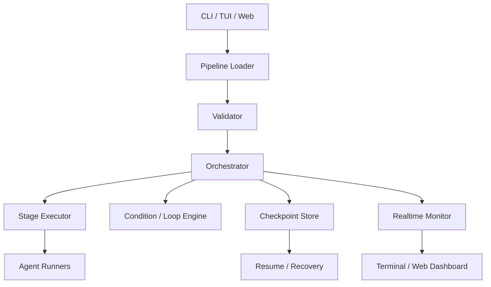
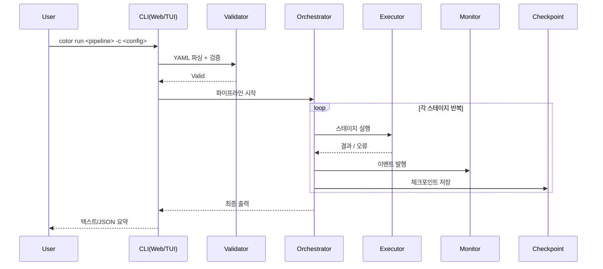

# Cotor 아키텍처

원문: [ARCHITECTURE.md](ARCHITECTURE.md)

Cotor는 **설정 기반 파이프라인 오케스트레이터**입니다. 현재 코드 기준 핵심 흐름은 아래와 같습니다.

`설정 로드 → 검증 → 오케스트레이션 → 모니터링/체크포인트 → 출력`

## 1) 상위 구성 요소

## 2) 런타임 흐름

## 3) 코드 기준 모듈 맵

- `src/main/kotlin/com/cotor/domain/`
  - orchestrator, executor, condition 엔진
- `src/main/kotlin/com/cotor/presentation/`
  - CLI, web, formatter
- `src/main/kotlin/com/cotor/monitoring/`
  - 런타임 이벤트와 모니터링
- `src/main/kotlin/com/cotor/checkpoint/`
  - 체크포인트 저장과 조회
- `src/main/kotlin/com/cotor/validation/`
  - 파이프라인과 설정 검증

## 4) 왜 이렇게 나뉘는가

- **관심사 분리**
  - 파싱, 검증, 실행, 표시를 분리해 변경 영향 범위를 줄입니다.
- **복구 가능성**
  - 체크포인트와 resume 계층을 통해 중단 후 분석 또는 재개 기반을 제공합니다.
- **관측 가능성**
  - 동일한 모니터 이벤트를 CLI, TUI, Web이 공유해 일관된 상태 표시가 가능합니다.

## 관련 문서

- [QUICK_START.md](QUICK_START.md)
- [FEATURES.md](FEATURES.md)
- [MULTI_WORKSPACE_REMOTE_RUNNER.md](MULTI_WORKSPACE_REMOTE_RUNNER.md)
- [WEB_EDITOR.md](WEB_EDITOR.md)
- [USAGE_TIPS.md](USAGE_TIPS.md)
