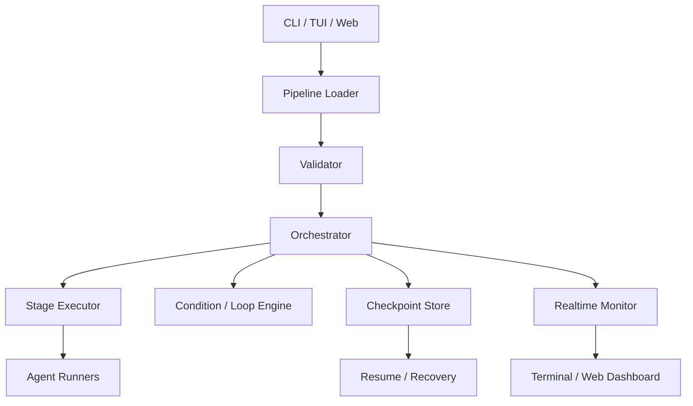
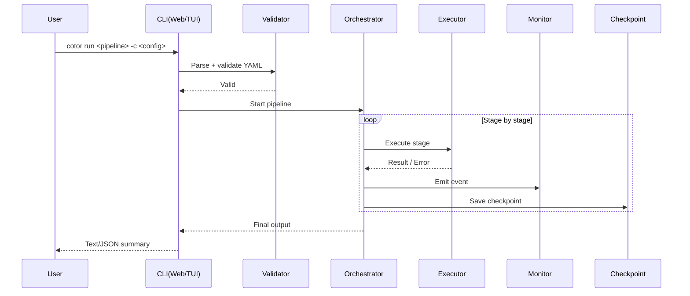

# Cotor Architecture

Cotor는 **설정 기반 파이프라인 오케스트레이터**입니다.
핵심 흐름은 `Config Load → Validate → Orchestrate → Monitor/Checkpoint → Output` 입니다.

## 1) High-level components

## 2) Runtime flow

## 3) Module map (code)

- `src/main/kotlin/com/cotor/domain/` : orchestrator, executor, condition
- `src/main/kotlin/com/cotor/presentation/` : CLI, web, formatter
- `src/main/kotlin/com/cotor/monitoring/` : runtime events/monitoring
- `src/main/kotlin/com/cotor/checkpoint/` : checkpoint persistence/resume
- `src/main/kotlin/com/cotor/validation/` : pipeline/config validation

## 4) Why this structure

- **Separation of concerns**: parsing/검증/실행/표시를 분리해 변경 영향 최소화
- **Resilience**: checkpoint + resume로 중단 후 복구 가능
- **Observability**: 모니터 이벤트를 통해 CLI/TUI/Web에서 동일한 실행 상태 표시

## 5) Runtime Control Layers

- `com.cotor.runtime.actions` : agent/git/github side effects를 하나의 action substrate로 수렴
- `com.cotor.policy` : action allow/deny/approval 결정을 수행하고 audit log를 남김
- `com.cotor.provenance` : run/checkpoint/action/file/pr 사이의 evidence graph를 저장
- `com.cotor.providers.github` : PR state, mergeability, status-check summary를 file-backed control-plane으로 유지
- `com.cotor.knowledge` : review outcome, mergeability, decision-like signals를 structured memory로 저장
- `AppServer` / `WebServer` : durable runtime, policy, evidence, GitHub, knowledge를 read surface로 노출

## 6) Company workflow invariants

The company automation layer has stricter workflow invariants than the generic pipeline runner.

- review queue items, QA issues, CEO approval issues, workflow tasks, and workflow runs are bound by explicit workflow lineage metadata for one PR review cycle
- a newer execution publish must supersede the older review lineage atomically; stale QA or CEO verdicts may not flow into the new PR cycle
- legacy company state is repaired during startup healing, company dashboard reads, and runtime ticks instead of silently reusing stale workflow results
- merge-conflict recovery and stale PR cleanup are tied to the superseded lineage so the company can continue without leaving blocked review artifacts behind
- follow-up goals carry explicit failure context so the company can distinguish generic blocked work from merge-conflict remediation and other review follow-up
- merge-conflict follow-up must reuse the existing PR branch/worktree and synthesize remediation plus validation work, not invent a new handoff PR cycle
- no-diff retries on an existing PR lineage must converge by refreshing the current PR state and reopening the right lane instead of dead-ending as a generic publish failure

---

관련 문서:
- [Quick Start](QUICK_START.md)
- [Features](FEATURES.md)
- [Multi-Workspace / Remote Runner Design](MULTI_WORKSPACE_REMOTE_RUNNER.md)
- [Web Editor](WEB_EDITOR.md)
- [Usage Tips](USAGE_TIPS.md)
