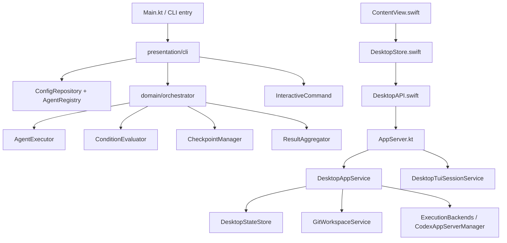
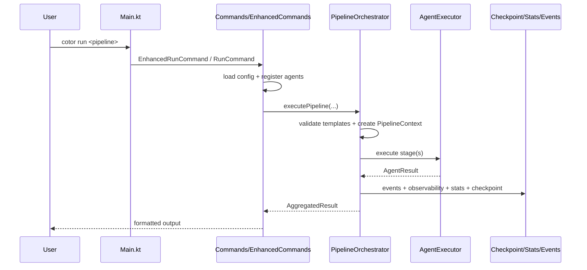
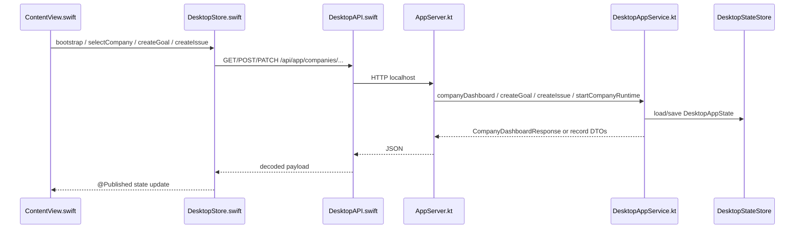
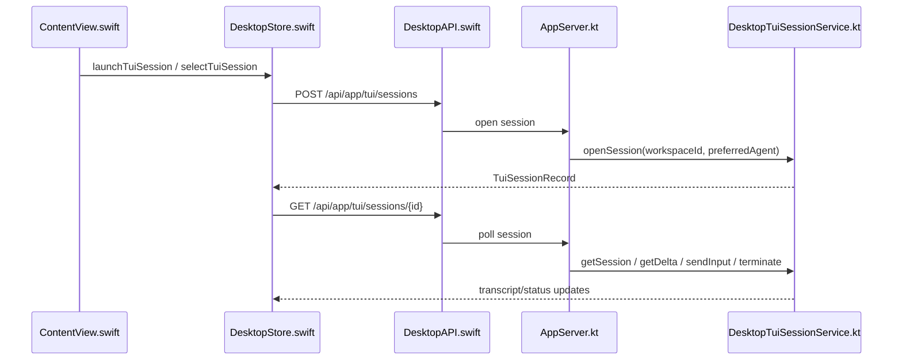

# Cotor 코드베이스 정밀 해부

이 문서는 Cotor를 "문서 설명"이 아니라 "현재 저장소 코드" 기준으로 이해하기 위한 정밀 안내서다.

기준 원칙:

- 현재 저장소에 실제로 구현된 동작만 다룬다.
- 제품 설명보다 `어느 파일의 어느 함수가 책임을 가지는지`를 우선한다.
- CLI/TUI, app-server, macOS desktop, company runtime을 하나의 연결된 로컬 시스템으로 본다.

## 1. 이 저장소가 실제로 구현한 제품 형태

현재 Cotor는 크게 두 층을 가진다.

1. 공용 Kotlin 런타임
- CLI 명령
- interactive TUI
- YAML 기반 pipeline orchestrator
- localhost `app-server`
- company automation/service layer

2. 네이티브 macOS shell
- SwiftUI 앱
- Kotlin `app-server`를 HTTP로 호출
- `Company` 모드와 `TUI` 모드를 최상위 셸로 유지

핵심 제품 불변조건은 문서와 코드가 일치한다.

- `Company`와 `TUI`는 최상위 셸 모드로 분리된다.
- desktop 앱은 별도 백엔드 제품이 아니라 localhost `cotor app-server` 위의 셸이다.
- company workflow 상태와 standalone TUI 세션은 동일한 저장소를 사용할 수 있어도 개념적으로 분리된다.

관련 진입 문서:

- `README.md`
- `docs/ARCHITECTURE.md`
- `docs/DESKTOP_APP.md`

## 2. 전체 레이어 맵

핵심 포인트:

- CLI pipeline 실행과 desktop company workflow는 완전히 분리된 제품이 아니라 같은 Kotlin 런타임 위에 놓여 있다.
- 다만 generic pipeline core와 company automation은 별도 책임으로 나뉜다.
- company runtime은 `DesktopAppService`에 많이 응집돼 있고, desktop shell은 `DesktopStore.swift`가 상태 중심 허브 역할을 한다.

## 3. 핵심 사용자 흐름 3개

### 3.1 CLI에서 pipeline 실행

핵심 진입점:

- `src/main/kotlin/com/cotor/Main.kt`
- `src/main/kotlin/com/cotor/presentation/cli/Commands.kt`
- `src/main/kotlin/com/cotor/presentation/cli/EnhancedCommands.kt`
- `src/main/kotlin/com/cotor/domain/orchestrator/PipelineOrchestrator.kt`

### 3.2 Desktop에서 company 작업 조회/조작

핵심 진입점:

- `src/main/kotlin/com/cotor/app/AppServer.kt`
- `src/main/kotlin/com/cotor/app/DesktopAppService.kt`
- `macos/Sources/CotorDesktopApp/DesktopAPI.swift`
- `macos/Sources/CotorDesktopApp/DesktopStore.swift`
- `macos/Sources/CotorDesktopApp/ContentView.swift`

### 3.3 Desktop TUI 세션 생성과 복구

핵심 포인트:

- desktop TUI는 websocket이 아니라 HTTP polling + input forwarding으로 동작한다.
- session이 stale 되면 `DesktopStore`가 복구 가능한 404/legacy 500을 감지하고 새 세션을 연다.

## 4. CLI 엔트리포인트와 명령 표면

### 4.1 `Main.kt`: 최상위 분기

`src/main/kotlin/com/cotor/Main.kt`

핵심 규칙:

- 인자가 없으면 `InteractiveCommand().main(emptyArray())`로 바로 interactive 진입
- 첫 인자가 `tui`면 `interactive` alias
- 알려진 subcommand가 아니고 `-`로 시작하지 않으면 `SimpleCLI().run(args)`로 direct pipeline 실행
- 알려진 subcommand면 `CotorCli().subcommands(...)`로 전체 Clikt 표면 사용

즉, `Main.kt`는 "interactive 기본 진입 + direct pipeline fallback + full CLI" 세 갈래 스위치다.

### 4.2 `Commands.kt`: 기본 명령 표면

`src/main/kotlin/com/cotor/presentation/cli/Commands.kt`

이 파일에서 확인되는 역할:

- `CotorCli`: 루트 CLI
- `HelpCommand`: 한국어/영어 도움말
- `InitCommand`: 기본 config, interactive scaffold, starter-template scaffold 생성
- `RunCommand`: config load -> agent register -> pipeline lookup -> orchestrator 실행
- `StatusCommand`: `PipelineRunTracker` 기반 활성/최근 pipeline 표시
- `ListCommand`: config 기반 agent 목록 표시
- `VersionCommand`, `CompletionCommand`

여기서 중요한 점은 pipeline 실행이 presentation 계층에서 직접 이루어지지 않고, agent 등록과 pipeline 선택까지만 맡은 뒤 orchestrator로 넘긴다는 점이다.

### 4.3 `InteractiveCommand.kt`: interactive/TUI 핵심

`src/main/kotlin/com/cotor/presentation/cli/InteractiveCommand.kt`

핵심 함수:

- `run`: 전체 interactive bootstrap
- `resolveInitialChatMode`: 기본 모드는 `SINGLE`
- `parseAgentsOption`: compare/auto 대상 에이전트 집합 해석
- `resolveActiveAgent`: single mode 활성 에이전트 결정
- `preferredSingleAgent`: `codex` -> `starter` 태그 -> 첫 agent 순
- `runTurnWithSpinner`: 일반 CLI에서는 spinner, desktop PTY에서는 spinner 비활성화
- `runTurn`: single / compare / auto 실제 실행
- `runInteractiveLoop`: `:help`, `:mode`, `:use`, `:model`, `:include`, `:clear`, `:save`, `:exit`
- `loadBootstrapContext`: `AGENTS.md`, `README.md`, `README.ko.md`, `docs/README.md` 일부를 프롬프트 부트스트랩으로 주입
- `shouldRefreshStarterConfig`, `writeStarterConfig`: packaged 첫 실행과 AI-ready starter 갱신

interactive 초기화 흐름:

1. `resolveInteractiveConfigPath`로 실제 config 경로 결정
2. config가 없으면 starter config 자동 생성
3. echo starter만 있고 real AI가 준비됐으면 starter 갱신
4. agent 등록
5. transcript/log 디렉터리 생성
6. `ChatSession` 복원
7. prompt-only / prompt-file / full interactive loop 중 하나 실행

### 4.4 interactive transcript/log

관련 파일:

- `src/main/kotlin/com/cotor/presentation/cli/InteractiveCommand.kt`
- `src/main/kotlin/com/cotor/presentation/cli/InteractiveSessionLogger.kt`
- `com.cotor.chat.ChatTranscriptWriter` 사용

실제 저장 동작:

- transcript 디렉터리는 `defaultSaveDir(...)` 또는 `--save-dir`
- session history는 `session.jsonl` 기반으로 로드
- 성공 turn마다 markdown/raw/jsonl을 모두 갱신
- `interactive.log`는 별도 디버그 로그로 남김

`InteractiveSessionLogger`가 기록하는 항목:

- `session_started`
- `turn_started`
- `turn_completed`
- `agent_result`
- `stacktrace`
- `session_ended`

즉 transcript는 사용자 대화 기록, `interactive.log`는 실행 진단 로그다.

### 4.5 interactive mode semantics

- `SINGLE`
  - `activeAgent` 하나만 실행
  - 기본 agent는 codex 우선
- `COMPARE`
  - 선택된 agent 전부 실행
  - `ResultAggregator`의 `aggregatedOutput`을 반환
- `AUTO`
  - 선택된 agent 전부 실행
  - 보통 best agent만 보여주고, `--show-all`이면 compare처럼 전체 출력

desktop PTY 특수 처리:

- `COTOR_DESKTOP_TUI=1`이면 spinner를 끄고 plain prompt 사용
- `normalizeInteractiveInput(..., isDesktopTui = true)`는 echoed `you>` 프롬프트와 ANSI 조각을 제거
- 이는 desktop embedded PTY가 prompt 문자열을 다시 입력으로 넘기는 상황을 방어한다

## 5. 파이프라인 실행 코어

### 5.1 orchestrator의 책임

`src/main/kotlin/com/cotor/domain/orchestrator/PipelineOrchestrator.kt`

인터페이스:

- `executePipeline`
- `cancelPipeline`
- `getPipelineStatus`

`DefaultPipelineOrchestrator`가 하는 일:

1. execution mode와 stage type의 호환성 검증
2. `PipelineContext` 생성
3. template validation
4. observability trace 시작
5. mode별 executor로 분기
6. event bus / stats / checkpoint 저장

### 5.2 execution mode별 실제 구현

핵심 함수:

- `executeSequential`
- `executeParallel`
- `executeDag`
- `executeMap`

정리:

- `SEQUENTIAL`
  - execution/decision/loop 모두 지원
  - `previousOutput`과 template interpolation을 함께 사용
  - decision/loop가 index를 이동시킨다
- `PARALLEL`
  - execution stage만 허용
  - 각 stage를 독립 `async`로 실행
- `DAG`
  - execution stage만 허용
  - `topologicalSort` 후 dependency output을 input으로 이어준다
- `MAP`
  - fanout stage가 정확히 하나여야 함
  - `pipelineContext.sharedState[sourceName]`의 list를 입력 source로 사용

### 5.3 stage 실행과 failure/timeout

핵심 함수:

- `executeStageWithGuards`
- `runStage`

실행 구조:

- stage는 `recoveryExecutor.executeWithRecovery(...)`를 통해 실제 실행된다
- timeout은 pipeline-level과 stage-level이 분리된다
- stage timeout 결과는 `failureCategory=TIMEOUT` 메타데이터와 함께 `AgentResult`로 저장된다
- optional stage 또는 `FailureStrategy.CONTINUE`면 실패를 결과로 흡수하고 진행한다
- 그렇지 않으면 예외를 다시 던진다

### 5.4 decision/loop/condition

관련 함수:

- `executeDecisionStage`
- `resolveDecisionNextIndex`
- `handleLoopStage`
- `applySharedStateUpdates`

관련 패키지:

- `src/main/kotlin/com/cotor/domain/condition/ConditionEvaluator.kt`
- `Parser.kt`
- `Scanner.kt`
- `Expression.kt`

의미:

- condition DSL은 scanner/parser/expression AST -> `ConditionEvaluator` 방문자 패턴으로 평가된다
- decision stage는 expression 평가 후 `CONTINUE`, `GOTO`, `ABORT` 중 하나를 선택한다
- loop stage는 `untilExpression`과 `maxIterations`를 이용해 target stage로 되돌린다
- decision outcome은 shared state를 갱신할 수 있고, 이 값은 후속 template interpolation에 사용된다

### 5.5 templating / recovery / checkpoint

templating:

- `TemplateEngine`로 stage input과 shared state 값을 interpolation
- template validation은 실행 전에 `PipelineTemplateValidator`로 선검증

recovery:

- orchestrator는 직접 agent를 부르지 않고 `RecoveryExecutor`를 거친다
- 이 구조 때문에 retry/recovery 정책이 stage 레벨에서 통합된다

checkpoint:

- `saveCheckpoint`는 완료된 stage result를 checkpoint로 저장
- `resume` 명령은 존재하지만 README 문서대로 full run resumption은 아직 제한적이다

## 6. Agent 실행 계층

`src/main/kotlin/com/cotor/domain/executor/AgentExecutor.kt`

핵심 함수:

- `executeAgent`
- `executeWithRetry`

실행 단계:

1. `SecurityValidator.validate(agent)`
2. `PluginLoader.loadPlugin(agent.pluginClass)`
3. plugin input validation
4. `ExecutionContext` 구성
5. `plugin.execute(context, processManager)` 호출
6. `AgentResult` 구성

retry 구조:

- retry는 plugin 내부가 아니라 executor 레벨에서 적용
- exponential backoff 계산도 executor가 담당
- interactive `--retry`와 pipeline recovery 모두 이 실행 계층 위에서 붙는다

desktop PTY 특수 처리:

- `COTOR_DESKTOP_TUI=1`일 때는 full stacktrace logging을 줄여 embedded terminal 오염을 막는다

## 7. app-server와 desktop 경계

### 7.1 `AppServer.kt`: localhost 계약

`src/main/kotlin/com/cotor/app/AppServer.kt`

핵심 특징:

- Ktor 기반
- health/ready는 무인증
- `/api/app/*`는 bearer token 가능
- desktop 전용 라우트는 `DesktopAppService`와 `DesktopTuiSessionService`로 위임
- JSON 에러를 일정하게 유지하려고 `respondDesktopRequest(...)`를 둔다
- app-server 인스턴스 lock 파일을 사용해 중복 실행을 막는다

주요 route 그룹:

| 그룹 | 예시 경로 | 실제 책임 |
| --- | --- | --- |
| health | `/health`, `/ready`, `/api/app/health` | backend reachability |
| settings/backends | `/api/app/settings/backends/*` | backend 기본값/테스트 |
| repositories | `/api/app/repositories/*` | open/clone/branch 목록 |
| workspaces | `/api/app/workspaces` | branch-context 생성 |
| tasks | `/api/app/tasks/*` | task 생성, run 시작, task별 changes/files/ports |
| runs/files/ports | `/api/app/runs`, `/api/app/changes`, `/api/app/files`, `/api/app/ports` | run inspector |
| companies | `/api/app/companies/*` | company/goal/issue/review/activity/runtime 중심 |
| issues/review-queue | `/api/app/issues/*`, `/api/app/review-queue/*` | delegate/run/merge |
| tui/sessions | `/api/app/tui/sessions/*` | interactive PTY session lifecycle |

### 7.2 `DesktopAppService.kt`: 사실상 제품 서비스 레이어

`src/main/kotlin/com/cotor/app/DesktopAppService.kt`

중심 공개 함수:

- `dashboard`
- `companyDashboard`
- `companyEvents`
- `createCompany`, `updateCompany`
- `createGoal`, `decomposeGoal`
- `createIssue`, `delegateIssue`, `runIssue`
- `mergeReviewQueueItem`
- `startCompanyRuntime`, `stopCompanyRuntime`
- `runTask`, `getChanges`, `listFiles`, `listPorts`
- `settings`

이 파일이 큰 이유는 company automation 대부분이 이 서비스에 응집돼 있기 때문이다.

### 7.3 `dashboard` vs `companyDashboard`

- `dashboard()`
  - 전역 desktop snapshot
  - repositories/workspaces/tasks/settings/companies/... 전부 포함
  - read 시점에 automation refresh를 큐에 넣어 healing도 같이 유도
- `companyDashboard(companyId)`
  - 선택 회사만 잘라낸 focused snapshot
  - Swift `Company` 모드의 실시간 갱신 경로

즉 full refresh와 company-scoped refresh가 분리돼 있고, desktop client는 필요할 때 company snapshot만 부분 갱신한다.

### 7.4 상태 저장

상태 모델:

- `DesktopAppState`
- `Company`
- `CompanyGoal`
- `CompanyIssue`
- `AgentTask`
- `AgentRun`
- `ReviewQueueItem`
- `CompanyRuntimeSnapshot`
- `WorkflowPipelineDefinition`
- `AgentContextEntry`
- `AgentMessage`

상태 저장소:

- `src/main/kotlin/com/cotor/app/DesktopStateStore.kt`

이 저장소는 desktop/company/TUI 상태의 영속화 루트다.

### 7.5 run inspector 데이터

`DesktopAppService`는 inspector용 데이터를 따로 제공한다.

- `getChanges(runId)`: git diff summary
- `listFiles(runId, relativePath)`: worktree file tree
- `listPorts(runId)`: 프로세스가 연 포트 탐색

이 셋은 모두 run이 가진 `worktreePath` 또는 `processId`를 통해 런타임 사실을 노출한다.

## 8. Kotlin ↔ Swift 계약표

현재 desktop contract는 대부분 이름이 거의 1:1 대응된다.

| Kotlin | Swift |
| --- | --- |
| `DashboardResponse` | `DashboardPayload` |
| `CompanyDashboardResponse` | `CompanyDashboardPayload` |
| `CompanyGoal` | `GoalRecord` |
| `CompanyIssue` | `IssueRecord` |
| `ReviewQueueItem` | `ReviewQueueItemRecord` |
| `CompanyRuntimeSnapshot` | `CompanyRuntimeSnapshotRecord` |
| `TuiSession` | `TuiSessionRecord` |
| `ChangeSummary` | `ChangeSummaryPayload` |
| `FileTreeNode` | `FileTreeNodePayload` |
| `PortEntry` | `PortEntryPayload` |
| `DesktopSettings` | `DesktopSettingsPayload` |

주의할 점:

- Swift 쪽은 `decodeValue(..., default: ...)` 패턴으로 일부 필드 누락을 흡수한다.
- `CompanyRuntimeSnapshotRecord`는 수동 decode/default 값이 많아 Kotlin 응답 변화에 비교적 관대하다.
- 반대로 route path나 payload shape가 바뀌면 `DesktopAPI.swift`와 `DesktopStore.swift`를 동시에 고쳐야 한다.

## 9. macOS shell 해부

### 9.1 `DesktopAPI.swift`

역할:

- app-server transport 전담
- route path와 HTTP verb를 Swift 쪽에 고정
- dashboard/companyDashboard/companyEvents/TUI routes를 thin client로 노출

핵심 포인트:

- 기본 base URL은 `http://127.0.0.1:8787`
- 기본 token은 embedded local token
- company event stream은 `AsyncThrowingStream`으로 NDJSON 라인을 디코드

### 9.2 `DesktopStore.swift`

이 파일이 Swift 쪽 사실상의 앱 상태 허브다.

핵심 함수:

- `bootstrap`
- `refreshDashboard`
- `refreshFullDashboard`
- `refreshCompanyDashboard`
- `applyCompanyDashboard`
- `restartCompanyEventStream`
- `startCompanyStatePolling`
- `startEmbeddedBackendWatchdog`
- `handleShellModeChange`
- `refreshTuiSessionList`
- `ensureTuiSession`
- `launchTuiSession`
- `selectTuiSession`
- `terminateTuiSession`
- `restartTuiSession`

실제 설계 특징:

- bootstrap 시 background observers를 먼저 올리고 embedded backend를 확보한 뒤 첫 refresh를 시도
- full dashboard와 company dashboard refresh를 분리
- company mode는 event stream을 주 경로로 쓰고, polling은 복구용 fallback
- selection repair가 매우 공격적이다. refresh 후 stale ID를 계속 살려두지 않는다
- TUI session은 company state와 별개로 유지되며, session switching만 store가 조정한다

### 9.3 event stream과 복구

company mode:

- `restartCompanyEventStream()`이 `api.companyEvents(companyId:)`를 구독
- payload 안에 `companyDashboard`가 있으면 부분 병합
- stream 실패 시 `companyStreamStatusMessage = "Live company updates disconnected. Re-syncing..."` 설정
- 이후 `refreshCompanyDashboard` -> 1초 대기 -> stream 재시작

polling:

- `startCompanyStatePolling()`은 stream이 끊기거나 offline일 때 10초 간격 fallback refresh
- `startEmbeddedBackendWatchdog()`는 5초 간격으로 embedded backend 유지

### 9.4 TUI session 수명주기

핵심 함수:

- `ensureTuiSession(forceRestart:)`
- `startTuiPolling(sessionID, workspaceID)`
- `recoverFromStaleTuiSession(...)`

핵심 동작:

- TUI 모드일 때만 세션 자동 보장
- workspace 기준으로 session 생성
- polling은 session snapshot을 반복 조회
- 404 또는 legacy blank 500은 stale session으로 간주
- stale session이면 session 제거 후 새 세션을 다시 연다

이 설계 덕분에 backend 재시작 후에도 TUI가 완전히 끊긴 것처럼 보이지 않고 회복 가능하다.

### 9.5 `ContentView.swift`

`ContentView.swift`는 상태 계산과 UI surface 구성이 크다.

실질적으로 보여주는 제품 모델:

- 최상위 `Company` / `TUI` mode picker
- company summary banner
- goals / issues / review / activity / runtime surfaces
- scrollable issue board lanes
- TUI center terminal surface
- inspector drawer with diffs/files/ports/browser/review metadata

코드에서 확인되는 문구 자체가 제품 모델을 명시한다.

- "One company maps to one folder and one runtime."
- "Each folder keeps its own independent Cotor TUI session."
- "The product's primary execution path is still TUI -> leader AI -> worker orchestration."

즉 UI도 company workflow와 standalone TUI를 혼합하지 않고 의도적으로 분리한다.

## 10. Company workflow 상태기계

### 10.1 핵심 엔티티

관련 모델:

- `Company`
- `CompanyGoal`
- `CompanyIssue`
- `AgentTask`
- `AgentRun`
- `ReviewQueueItem`
- `WorkflowLineageSnapshot`
- `CompanyRuntimeSnapshot`

실제 의미:

- `Goal`: CEO가 추적하는 최상위 목표
- `Issue`: 실행/리뷰/승인까지 포함한 회사 워크플로 단위
- `Task`: 실제 agent fanout 실행 단위
- `Run`: 개별 agent 실행 기록
- `ReviewQueueItem`: PR 중심 리뷰/승인/병합 단위
- `WorkflowLineageSnapshot`: 한 PR review cycle의 계보 추적자

### 10.2 Goal -> Issue

핵심 함수:

- `createGoal`
- `decomposeGoal`

`decomposeGoal`의 특징:

- 먼저 "CEO planning issue"를 만든다
- planning issue가 이미 진행 중이면 중복 생성하지 않는다
- deterministic fallback planner도 즉시 materialize할 수 있다
- goal에서 바로 여러 downstream execution issue로 이어지는 구조다

즉 company decomposition은 "goal -> planning issue -> execution issues"의 2단 구조다.

### 10.3 Issue -> Task/Run

핵심 함수:

- `createIssue`
- `delegateIssue`
- `runIssue`
- `startDelegatedIssue`
- `runTask`

흐름:

1. `createIssue`: company/goal/workspace/projectContext/assignee 결정
2. `delegateIssue`: org profile 기반 assignee 라우팅
3. `runIssue`: delegation 후 실행 시작
4. `startDelegatedIssue`: GitHub readiness 확인, 기존 task lineage 검사, 새 task 생성 또는 재사용
5. `runTask`: 실제 agent task 실행

Git/PR 연동 특징:

- code-producing issue는 GitHub readiness와 publish mode 영향을 받는다
- readiness가 안 되면 execution retry loop가 아니라 infra issue를 생성하고 원래 issue를 `BLOCKED`로 바꾼다

### 10.4 Review -> Merge -> Follow-up

핵심 함수:

- `mergeReviewQueueItem`
- `markReviewQueueMergeConflict`

흐름:

1. review queue item에서 PR metadata 확인
2. PR review comment + approve 제출
3. mergeability가 dirty면 remediation 경로로 전환
4. merge 성공 시 issue는 `DONE`, queue는 `MERGED`
5. merge conflict면 execution issue를 remediation intent로 되돌리고 approval issue는 `BLOCKED`

이때 중요한 축이 `WorkflowLineageSnapshot`이다.

- stale QA/CEO verdict 재적용 방지
- superseded PR lineage 정리
- merge-conflict follow-up이 새 PR cycle을 임의로 만들지 않도록 제어

### 10.5 Runtime

핵심 함수:

- `prepareCompanyAutomationState`
- `startCompanyRuntime`
- `stopCompanyRuntime`

runtime이 실제로 하는 일:

- legacy roster/follow-up migration
- persisted runtime resume
- stale agent run reconcile
- workflow lineage repair
- stale merge-conflict / dirty PR / blocked issue 재정규화
- autonomous progress stimulation

즉 runtime은 단순 scheduler가 아니라 "state healer + work stimulator"에 가깝다.

## 11. 테스트로 본 신뢰 구간

### 11.1 CLI / interactive

`src/test/kotlin/com/cotor/presentation/cli/InteractiveCommandTest.kt`

보호하는 동작:

- `--prompt` single 실행과 transcript 저장
- 기본 preferred single agent가 codex로 잡히는지
- `interactive.log`가 남는지
- compare/auto mode 출력
- 실패 시 `interactive.log`에 failure detail 기록
- desktop prompt normalization

### 11.2 orchestrator

관련 테스트:

- `PipelineOrchestratorTimeoutTest`
- `PipelineOrchestratorConditionalTest`
- `PipelineOrchestratorTemplatingTest`
- `PipelineOrchestratorMapTest`
- `PipelineOrchestratorPropertyTest`

보호하는 동작:

- pipeline/stage timeout
- decision reroute
- loop 반복
- template interpolation
- MAP fanout cardinality

### 11.3 app-server

`src/test/kotlin/com/cotor/app/AppServerTest.kt`

보호하는 동작:

- health/ready 무인증
- auth 있는 route의 bearer 강제
- shutdown route
- TUI session routes
- company runtime routes
- company create/delete/patch
- issue create/delete
- company dashboard snapshot
- company event stream snapshot 포함

### 11.4 desktop/company service

`src/test/kotlin/com/cotor/app/DesktopAppServiceTest.kt`

이 테스트 파일이 사실상 company workflow의 회귀 방어막이다.

주요 커버 범위:

- publish metadata 저장/실패/로컬 fallback
- goal decomposition과 CEO planning issue
- company runtime auto-start/stop/budget/manual stop
- Linear sync
- requeue/healing/recovery
- workflow lineage supersession
- QA/CEO review progression
- merge-conflict remediation
- stale blocked issue/PR 정리
- memory/context injection
- deleteCompany / deleteGoal / deleteIssue 정리

### 11.5 TUI session service

`src/test/kotlin/com/cotor/app/DesktopTuiSessionServiceTest.kt`

보호하는 동작:

- active session 목록 정렬
- terminate 후 exited snapshot 반환 및 제거

## 12. 지금 읽는 사람이 잡아야 할 핵심 결론

1. Cotor는 "pipeline tool"과 "company desktop app"이 따로 있는 저장소가 아니다.
- generic pipeline core와 company automation이 같은 Kotlin 런타임 안에 공존한다.

2. desktop shell의 진짜 중심은 SwiftUI View가 아니라 `DesktopStore.swift`다.
- event stream, polling, backend watchdog, selection repair, TUI session 복구가 여기 몰려 있다.

3. company workflow의 진짜 중심은 `DesktopAppService.kt`다.
- CRUD service를 넘어서 runtime healing, PR lineage repair, merge-conflict remediation까지 여기에 응집돼 있다.

4. interactive TUI는 단순 채팅창이 아니다.
- starter config 생성, prompt bootstrap, memory injection, transcript/log persistence, compare/auto selection, desktop PTY 방어 로직이 모두 들어 있다.

5. 이 저장소에서 가장 중요한 회귀 테스트는 `DesktopAppServiceTest.kt`다.
- 제품 모델의 미묘한 불변조건 상당수가 여기서 고정된다.

## 13. 추천 읽기 순서

빠르게 제품을 이해하려면 아래 순서가 가장 효율적이다.

1. `README.md`
2. `docs/ARCHITECTURE.md`
3. `src/main/kotlin/com/cotor/Main.kt`
4. `src/main/kotlin/com/cotor/presentation/cli/InteractiveCommand.kt`
5. `src/main/kotlin/com/cotor/domain/orchestrator/PipelineOrchestrator.kt`
6. `src/main/kotlin/com/cotor/app/AppServer.kt`
7. `src/main/kotlin/com/cotor/app/DesktopModels.kt`
8. `src/main/kotlin/com/cotor/app/DesktopAppService.kt`
9. `macos/Sources/CotorDesktopApp/DesktopAPI.swift`
10. `macos/Sources/CotorDesktopApp/DesktopStore.swift`
11. `macos/Sources/CotorDesktopApp/ContentView.swift`
12. `src/test/kotlin/com/cotor/app/DesktopAppServiceTest.kt`

## 14. 이번 분석에서 실제 확인한 검증

성공:

- `swift build` in `macos/`

실패:

- `PATH=/usr/bin:/bin:/usr/sbin:/sbin:/opt/homebrew/bin:/usr/local/bin:$PATH JAVA_HOME=$(/usr/libexec/java_home -v 17 2>/dev/null) ./gradlew test`
  - 319 tests completed, 1 failed
  - failing test: `com.cotor.app.DesktopAppServiceTest > runtime synthesizes deterministic merge-conflict follow-up issues on the existing PR lineage`

초기 환경 문제:

- 기본 셸 PATH가 비정상이라 `uname`, `java`, `sed` 같은 기본 도구가 바로 안 잡혔다
- 검증은 절대 경로와 JDK 17 고정으로 재시도했다

이 문서는 해당 시점의 코드와 테스트 출력 기준으로 작성했다.
