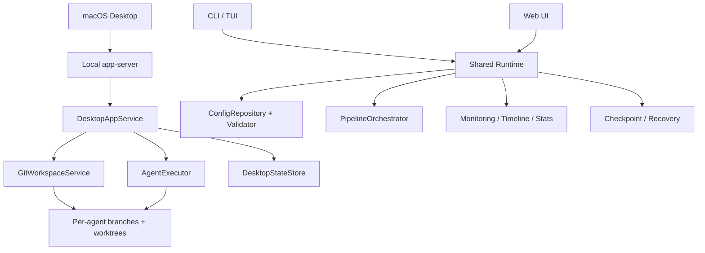

> Status: Architecture draft. This file is strategy/design context, not the source of truth for current product behavior. Use `docs/INDEX.md` for current docs.

# Cotor Differentiated PRD / Architecture

이 문서는 현재 구현된 Cotor 기능을 "무엇이 있는가"에서 끝내지 않고, "왜 이 제품이 필요한가"와 "왜 이런 구조를 택했는가"까지 연결하는 전략 문서다.

## 1. Problem / Opportunity

현재 AI 코딩 도구와 에이전트 실행기는 대체로 두 극단으로 나뉜다.

- 단일 에이전트 중심 CLI: 빠르지만 병렬 비교, 검증, 복구, 추적성이 약하다.
- SaaS 중심 오케스트레이터: 시각화는 좋지만 로컬 코드베이스 제어, 브랜치 격리, 보안 통제, 실행 재현성이 약하다.

Cotor의 기회는 이 간극을 메우는 데 있다.

- 로컬 저장소를 기준으로 여러 에이전트를 안전하게 병렬 실행한다.
- 실행 전 검증, 실행 중 모니터링, 실패 후 복구를 하나의 흐름으로 묶는다.
- CLI 사용자와 데스크톱 사용자 모두에게 같은 실행 엔진을 제공한다.

## 2. Target Users / JTBD

### Primary users

1. AI-assisted 개발자
   - "여러 모델에게 같은 작업을 맡기고 결과를 비교하고 싶다."
   - "내 로컬 저장소를 벗어나지 않는 방식으로 작업시키고 싶다."
2. 기술 리드 / 메이커
   - "실험용 프롬프트 툴이 아니라 재현 가능한 작업 흐름이 필요하다."
   - "실패한 실행을 다시 이어서 돌리고, 어떤 변경이 생겼는지 추적하고 싶다."
3. 멀티-에이전트 워크플로우를 설계하는 팀
   - "순차/병렬/DAG 파이프라인을 같은 도구 안에서 관리하고 싶다."
   - "데스크톱 UI와 터미널 환경을 혼용해도 동일한 실행 모델을 쓰고 싶다."

### Jobs to be done

- When 로컬 코드베이스에서 AI 작업을 실행해야 할 때,
  I want 각 에이전트를 분리된 브랜치/워크트리에서 돌리고,
  so I can 충돌 없이 결과를 비교하고 안전하게 통합할 수 있다.
- When 파이프라인이 길거나 실패 가능성이 있을 때,
  I want 사전 검증, 체크포인트, 상태 추적을 함께 사용하고,
  so I can 실패 비용과 재실행 비용을 낮출 수 있다.
- When 같은 작업을 CLI, 웹, 데스크톱 중 어떤 표면에서 시작하더라도,
  I want 동일한 엔진과 결과 모델을 공유하고,
  so I can 학습 비용과 운영 복잡도를 줄일 수 있다.

## 3. Differentiation Thesis

Cotor는 "로컬 우선 멀티-에이전트 작업 운영체제"를 지향한다.

### Core differentiation pillars

| Pillar | User value | Current evidence |
| --- | --- | --- |
| Local-first execution | 코드와 실행 컨텍스트를 사용자 환경에 둬 신뢰와 제어를 높인다. | CLI/TUI/Web/Desktop, localhost `app-server`, local repository onboarding |
| Isolated multi-agent work | 에이전트 간 파일 충돌을 줄이고 비교 가능한 결과를 만든다. | agent별 branch/worktree 생성, run별 diff/file inspection |
| Operational safety | 실행 전에 실패 가능성을 낮추고, 실행 중/후 상태를 추적한다. | validate, lint, doctor, security whitelist, checkpoint/resume |
| Multi-surface product | 같은 엔진을 CLI power-user와 UI 중심 사용자 모두가 쓴다. | `cotor` CLI, dashboard, web, macOS desktop shell |
| Recoverable orchestration | 긴 작업과 부분 실패를 실무에서 다루기 쉽게 만든다. | checkpoint, status/stats, timeline, background task model |

### Competitive position

- 단순 AI CLI보다 강한 점:
  - 단일 프롬프트 실행이 아니라 파이프라인, 검증, 복구, 모니터링을 제공한다.
  - 한 저장소 안에서 여러 에이전트를 병렬 실행해 결과 비교가 가능하다.
- 일반적인 hosted agent UI보다 강한 점:
  - 로컬 저장소/브랜치/워크트리를 중심으로 동작한다.
  - localhost API와 네이티브 셸을 사용해 사용자의 개발 환경과 더 가깝다.

## 4. Product Principles

- Local before hosted: 기본 경험은 로컬 저장소와 로컬 실행을 기준으로 설계한다.
- Safe before clever: 자동화 범위를 넓히기보다 검증, 격리, 복구를 우선한다.
- One runtime, many surfaces: CLI, Web, Desktop은 다른 프론트엔드이고 실행 코어는 하나다.
- Compare, then decide: 여러 에이전트 결과를 나란히 보고 선택/통합할 수 있어야 한다.
- Make failure visible: 실패를 숨기지 않고 상태, 로그, diff, 포트, 체크포인트로 드러낸다.

## 5. Non-goals

- 클라우드 기반 협업 백오피스 전체를 대체하는 것
- 중앙 서버가 모든 실행을 대행하는 managed platform이 되는 것
- 모든 AI 공급자/IDE를 깊게 통합하는 범용 플랫폼이 되는 것
- 자동 머지/자동 배포까지 기본 책임 범위를 넓히는 것

## 6. Core Experience Flows

### Flow A. CLI operator flow

1. 사용자가 `cotor validate` 또는 `cotor run`을 실행한다.
2. YAML 파이프라인과 에이전트 설정을 검증한다.
3. 오케스트레이터가 순차/병렬/DAG 모드로 스테이지를 실행한다.
4. 모니터링/타임라인/체크포인트가 실행 상태를 기록한다.
5. 사용자는 `status`, `stats`, `resume`으로 후속 조치를 이어간다.

### Flow B. Desktop orchestration flow

1. 사용자가 로컬 저장소를 등록하거나 Git URL을 clone한다.
2. 베이스 브랜치를 선택해 workspace를 만든다.
3. 하나의 task에 여러 agent를 붙여 실행한다.
4. 각 agent는 고유 branch/worktree에서 실행된다.
5. 사용자는 변경점, 파일 트리, 포트, 브라우저, TUI 세션으로 결과를 비교한다.

### Flow C. Recovery flow

1. 실행 중 실패 또는 중단이 발생한다.
2. 체크포인트와 상태 기록이 남는다.
3. 사용자는 실패 원인을 확인하고 `resume` 또는 재실행한다.
4. 재시작 비용 없이 긴 파이프라인을 이어갈 수 있다.

## 7. Capability Map

| Product goal | Required capability | Current implementation anchor |
| --- | --- | --- |
| 안전한 로컬 실행 | config validation, lint, whitelist security | `validation/`, `security/`, `doctor` |
| 멀티-에이전트 비교 | parallel runs, result aggregation, per-agent isolation | `domain/orchestrator/`, `analysis/`, `app/GitWorkspaceService.kt` |
| UI/CLI 공통 실행 코어 | reusable runtime + thin presentation layers | `presentation/cli/`, `presentation/web/`, `app/AppServer.kt` |
| 재현 가능한 작업 상태 | checkpoints, status, stats, run tracking | `checkpoint/`, `monitoring/`, `stats/` |
| 데스크톱 기반 작업 운영 | repository/workspace/task abstractions, localhost API | `app/DesktopAppService.kt`, `app/DesktopModels.kt`, `app/AppServer.kt` |

## 8. Architecture Overview

### Architectural intent

- Shared runtime:
  - 실행 의미론은 하나로 유지하고, CLI/Web/Desktop은 입력/출력 표면만 다르게 가져간다.
- Desktop service layer:
  - 저장소, workspace, task, run을 사용자 개념으로 감싸 Git 세부 구현을 숨긴다.
- Git isolation layer:
  - 각 agent 실행을 branch/worktree에 격리해 결과 비교와 충돌 회피를 동시에 달성한다.
- Validation and recovery layer:
  - "실행했다가 망가져도 된다"가 아니라 "실행 전후 모두 관리된다"는 경험을 만든다.

## 9. Key Architecture Decisions And Why

### A. Localhost app-server for desktop

- 결정:
  - 데스크톱 앱은 Kotlin 코어를 직접 내장하지 않고 `cotor app-server`와 HTTP로 통신한다.
- 이유:
  - 실행 코어를 재사용하면서 UI 기술 스택을 분리할 수 있다.
  - SwiftUI 셸은 표현과 상호작용에 집중하고, 실행 로직은 JVM 런타임에 남긴다.

### B. Repository -> Workspace -> Task -> Run model

- 결정:
  - 데스크톱 경험의 핵심 단위를 저장소, 워크스페이스, 태스크, 런으로 나눈다.
- 이유:
  - 브랜치가 다른 작업을 분리하고, 여러 agent 실행을 한 task 아래 묶을 수 있다.
  - 결과 비교, diff 조회, 파일 탐색, 포트 탐색을 안정적으로 매핑할 수 있다.

### C. Per-agent branch/worktree isolation

- 결정:
  - 각 agent 실행은 `codex/cotor/<task>/<agent>` 브랜치와 `.cotor/worktrees/...` 경로를 가진다.
- 이유:
  - 같은 저장소에서 병렬 실행해도 파일 충돌을 최소화한다.
  - agent별 diff와 결과 비교를 자연스럽게 만들 수 있다.

### D. Validation before orchestration

- 결정:
  - config, stage dependency, agent existence, 보안 규칙을 실행 전에 검증한다.
- 이유:
  - "오랜 실행 후 뒤늦게 실패"하는 비용을 줄인다.
  - 운영형 도구로서 신뢰도를 높인다.

### E. Checkpoint and status as first-class runtime outputs

- 결정:
  - 성공 결과뿐 아니라 진행 상태, 체크포인트, 통계 자체를 제품 표면으로 노출한다.
- 이유:
  - 긴 작업에서 핵심 가치는 단순 실행이 아니라 관찰 가능성과 복구 가능성이다.

## 10. Non-functional Requirements

| Requirement | Why it matters | Architectural response |
| --- | --- | --- |
| Trust | 로컬 코드와 비밀을 다루기 때문 | local-first, whitelist validation, localhost API |
| Isolation | 다중 에이전트 병렬 실행 충돌 방지 | branch/worktree per agent |
| Recoverability | 긴 실행의 재시도 비용 절감 | checkpoint, resume, status tracking |
| Observability | 실패/지연 원인 파악 | timeline, monitoring, diff/files/ports |
| Extensibility | agent/plugin surface 확장 | plugin loader, agent registry, thin app-server |

## 11. Success Metrics / Validation

### Product success metrics

- 신규 사용자가 첫 pipeline 실행 또는 첫 desktop task 생성까지 도달하는 시간
- validation 통과 후 실행 실패율
- checkpoint/resume를 통해 절약된 재실행 비율
- task당 agent 2개 이상을 사용하는 멀티-에이전트 실행 비중
- desktop task에서 diff/file/port inspection까지 이어지는 후속 탐색 비율

### Validation questions

- 사용자는 단일 에이전트 실행보다 agent 비교 흐름을 실제로 더 가치 있게 느끼는가?
- workspace/branch/worktree 모델이 사용자에게 이해 가능한 개념인가?
- desktop shell이 CLI 사용자 외 새로운 사용자군을 여는가?
- validate/lint/doctor가 초기 실패를 유의미하게 줄이는가?

## 12. Phased Roadmap

### Phase 1. Reliable local orchestration

- CLI/TUI/Web 공통 실행 코어 안정화
- validation, monitoring, checkpoint, stats 완성도 강화
- template/doctor/lint로 초기 설정 비용 축소

### Phase 2. Desktop differentiation

- macOS shell + localhost app-server
- repository/workspace/task abstraction
- per-agent branch/worktree isolation
- diff/file/port/browser inspection

### Phase 3. Decision support

- agent 결과 비교/요약 강화
- run history와 trend analysis 심화
- task별 리뷰/merge-ready 판단 보조

## 13. Risks / Trade-offs

- local-first는 강점이지만, 협업과 중앙 관리 기능은 약할 수 있다.
- workspace/worktree 모델은 강력하지만 초보 사용자에게는 개념 부담이 있다.
- 프론트엔드 표면이 늘수록 UX 일관성 유지 비용이 커진다.
- localhost API + native shell 조합은 강력하지만 배포/진단 경로가 복잡해질 수 있다.

## 14. Open Questions

- desktop shell의 read-only settings를 어디까지 write-capable workflow로 확장할 것인가?
- branch/worktree 결과를 최종 merge workflow와 어떻게 더 자연스럽게 연결할 것인가?
- run history persistence를 desktop/UI 관점에서 어떤 수준까지 노출할 것인가?

## 15. Document Intent

이 문서는 기존 `ARCHITECTURE.md`를 대체하지 않는다. 기존 문서가 런타임 구조를 설명한다면, 이 문서는 제품 차별화 관점에서 왜 그 구조가 필요한지 설명하는 상위 문서다.
