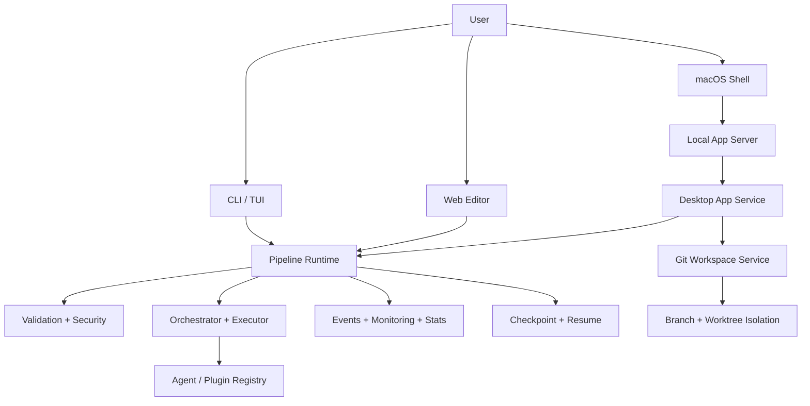

# Cotor Differentiation PRD & Architecture

이 문서는 Cotor의 "왜 지금 필요한가"와 "무엇을 어떻게 다르게 만들 것인가"를
하나의 기준 문서로 정리한다. 기존 `FEATURES.md`, `ARCHITECTURE.md`,
`DESKTOP_APP.md`가 기능과 구현 조각을 설명했다면, 이 문서는 그 조각들을
제품 전략과 아키텍처 의사결정으로 연결하는 역할을 한다.

## 1. Problem Statement

현재 AI 코딩/자동화 도구는 다음 세 가지를 동시에 만족시키지 못하는 경우가 많다.

1. 여러 에이전트와 스테이지를 반복 가능하게 오케스트레이션한다.
2. 실행 전에 설정/보안/의존성 오류를 적극적으로 차단한다.
3. 실행 결과를 복구 가능하고 관측 가능한 방식으로 남긴다.

그 결과 사용자는 "한 번 돌아간 프롬프트"는 만들 수 있어도, 팀이 재사용 가능한
실행 시스템으로 발전시키기 어렵다. 특히 로컬 리포지토리 작업에서는 에이전트별
격리 실행, 변경점 비교, 재실행/복구가 분리되어 있어 운영 비용이 커진다.

## 2. Product Thesis

Cotor의 차별화 포인트는 "AI 실행을 한 번의 채팅"이 아니라
"검증 가능한 파이프라인 런타임"으로 다루는 데 있다.

핵심 차별화 축은 네 가지다.

| 차별화 축 | 사용자 가치 | 현재 근거 |
| --- | --- | --- |
| Config-first orchestration | 단발성 프롬프트를 반복 가능한 자산으로 전환 | `validate`, `lint`, `template`, YAML 파이프라인 |
| Safe execution by default | 실행 전에 구조/보안/출력 규칙을 강제 | `validation/`, `security/`, output validator |
| Observable and recoverable runs | 실패해도 어디까지 진행됐는지 파악하고 재개 가능 | `event`, `monitoring`, `checkpoint`, `resume`, `stats` |
| Workspace-isolated multi-agent delivery | 실제 로컬 리포지토리 작업을 에이전트별 브랜치/워크트리로 격리 | `com.cotor.app`, `GitWorkspaceService`, macOS shell |

## 3. Target Users And JTBD

### Primary users

- AI를 이용해 반복적인 코드/문서 작업을 자동화하려는 개인 개발자
- 여러 에이전트를 비교, 검증, 합의시키는 실험형 워크플로우를 운영하는 팀
- 로컬 리포지토리 기준으로 안전하게 태스크를 분리 실행하려는 운영자/테크리드

### Jobs to be done

- "여러 AI 에이전트에게 같은 문제를 맡기고 결과를 비교 가능한 형태로 받고 싶다."
- "실패 지점과 입력/출력을 남기면서 다시 돌릴 수 있는 파이프라인이 필요하다."
- "실제 리포지토리 작업을 에이전트별 브랜치/워크트리로 격리하고 싶다."
- "CLI, 웹, 데스크톱 어디서 실행하더라도 같은 런타임/상태 모델을 공유하고 싶다."

## 4. Goals And Non-Goals

### Goals

1. YAML 기반 파이프라인 정의를 중심으로 실행/검증/복구를 하나의 제품 경험으로 묶는다.
2. CLI 중심 도구를 넘어서 웹과 macOS 앱에서도 동일한 런타임을 노출한다.
3. 에이전트별 격리 실행을 통해 실제 리포지토리 작업까지 제품 스코프에 포함한다.
4. 추후 협업/승인/품질게이트를 붙일 수 있는 안정적인 아키텍처 경계를 만든다.

### Non-goals

- 범용 클라우드 오케스트레이터처럼 원격 분산 실행을 먼저 해결하지 않는다.
- 에이전트 자체의 모델 품질을 Cotor의 핵심 차별화로 삼지 않는다.
- 모든 IDE 경험을 대체하는 풀스택 IDE를 목표로 하지 않는다.
- 대규모 멀티테넌트 SaaS 제어평면을 현재 범위에 포함하지 않는다.

## 5. Success Metrics

### Product metrics

- 사용자가 직접 작성하거나 템플릿으로 생성한 파이프라인의 재실행 비율
- `validate` 또는 `lint` 단계에서 실행 전 차단된 오류 수
- 체크포인트 기반 `resume` 성공률
- 데스크톱 앱에서 생성된 task 중 에이전트별 worktree/run 생성 성공률

### Engineering metrics

- 파이프라인 실패 시 원인 분류 가능 비율
- 이벤트/체크포인트 누락 없이 복구 가능한 실행 비율
- 브랜치/워크트리 충돌 없이 task 재실행이 재현되는 비율

## 6. Scope Plan

### Phase 1: Reliable local orchestrator

- YAML 파이프라인 실행 모드: sequential, parallel, DAG, map
- validate/lint/output validation
- checkpoint/resume/stats/status
- TUI, watch mode, web editor

### Phase 2: Workspace-aware delivery

- 로컬 저장소 등록 및 base branch 선택
- task/workspace 모델 추가
- 에이전트별 branch/worktree 격리 실행
- diff/files/ports/browser inspection

### Phase 3: Reviewable automation system

- 수동 QA plan, approval gate, richer policy hooks
- task template catalog and org presets
- 외부 시스템 연동 및 검증 자동화 강화

## 7. Architecture Principles

1. One runtime, many surfaces
   CLI/TUI/Web/macOS는 각자 UI만 다르고 실행 코어는 공유한다.
2. Validation before mutation
   실행이나 파일 변경 전에 구조/보안/출력 규칙을 먼저 통과시킨다.
3. Isolation over convenience
   실제 리포지토리 작업은 에이전트별 브랜치/워크트리로 격리한다.
4. Events and checkpoints as first-class data
   실행 상태는 화면 렌더링 부가정보가 아니라 복구/관측의 기준 데이터다.
5. Keep the desktop API thin
   macOS 앱은 프레젠테이션과 로컬 상호작용에 집중하고, 비즈니스 로직은 Kotlin 코어에 둔다.

## 8. Target Architecture

## 9. Component Responsibilities

| Layer | 주요 모듈 | 책임 |
| --- | --- | --- |
| Experience layer | `presentation/cli`, `presentation/web`, `presentation/timeline`, `macos/` | 사용자 입력, 시각화, 명령 진입점 |
| App integration layer | `com.cotor.app` | repository/workspace/task 모델, desktop API, TUI session bridge |
| Orchestration layer | `domain/orchestrator`, `domain/executor`, `domain/condition` | 스테이지 실행, 분기/루프, 모드별 오케스트레이션 |
| Trust layer | `validation/`, `validation/output/`, `security/` | 파이프라인/출력/보안 검증 |
| Recovery layer | `checkpoint/`, `recovery/` | 실행 상태 저장, resume, 장애 복구 |
| Insight layer | `event/`, `monitoring/`, `stats/` | 실행 이벤트, 타임라인, 상태/통계 |
| Extension layer | `data/plugin`, `data/registry`, `agent` commands | 에이전트 프리셋과 플러그인 확장성 |

## 10. Key Runtime Flows

### 10.1 Pipeline execution flow

1. 사용자가 CLI/TUI/Web에서 파이프라인 실행을 요청한다.
2. 설정 로더와 검증 계층이 YAML 구조, 의존성, 템플릿, 보안 규칙을 검사한다.
3. 오케스트레이터가 실행 모드에 맞춰 스테이지를 스케줄링한다.
4. 각 스테이지 실행 결과는 이벤트, 타임라인, 통계, 체크포인트로 기록된다.
5. 실패 시 abort/continue 정책과 timeout policy를 반영하고, 필요하면 resume 가능 상태를 남긴다.

### 10.2 Desktop repository task flow

1. 사용자가 로컬 저장소를 열거나 Git URL을 clone 한다.
2. `GitWorkspaceService`가 git root와 기본 브랜치를 판별한다.
3. workspace 생성 시 base branch가 고정된다.
4. task 실행 시 에이전트별 branch/worktree가 만들어지거나 기존 경로를 재사용한다.
5. macOS 앱은 diff, file tree, ports, browser view를 같은 task/run 모델로 조회한다.

### 10.3 Recovery and observability flow

1. 오케스트레이터가 stage result를 `PipelineContext`에 축적한다.
2. 이벤트 버스가 시작, 진행, 실패, 완료 이벤트를 발행한다.
3. stats manager와 checkpoint manager가 후속 분석과 재개를 위한 데이터를 남긴다.
4. 사용자는 `status`, `stats`, `resume`, dashboard, desktop API를 통해 동일한 실행 상태를 소비한다.

## 11. Why This Architecture Wins

### Against prompt-only tooling

- 프롬프트 결과가 아니라 실행 정의와 검증 규칙이 남는다.
- 에이전트 실험이 재현 가능한 파이프라인 자산으로 축적된다.

### Against script-only automation

- 조건/루프/DAG, 출력 검증, 타임라인, resume 같은 AI 작업 특화 런타임을 제공한다.
- 에이전트와 플러그인 확장이 제품 모델 안에서 관리된다.

### Against UI-only copilots

- 리포지토리 격리 실행과 로컬 git 기반 변경 추적이 핵심 모델에 포함된다.
- CLI와 앱이 별도 구현체가 아니라 공통 코어를 공유한다.

## 12. Risks And Mitigations

| Risk | Impact | Mitigation |
| --- | --- | --- |
| 기능은 많지만 차별화 메시지가 분산돼 보임 | 제품 포지셔닝 약화 | 이 문서를 기준으로 README, 데모, 릴리스 노트 메시지 정렬 |
| 데스크톱 기능이 코어 런타임과 어긋날 수 있음 | UI와 CLI 경험 불일치 | app layer는 thin API만 제공하고 실행 로직은 Kotlin 코어에 유지 |
| worktree/git shelling 실패 시 사용자 신뢰 저하 | 실제 delivery use case 차질 | `GitWorkspaceService` 단일화, default branch detection, 재실행 시 worktree 재사용 |
| 검증/체크포인트가 선택 기능으로 밀릴 수 있음 | 차별화 축 약화 | validation/recovery를 optional addon이 아닌 기본 경로로 유지 |

## 13. Validation Plan

- 문서가 제품 차별화, 사용자, 목표, 비목표, 성공 지표를 모두 포함하는지 확인
- 문서가 현재 코드 구조와 맞는 모듈/경계만 언급하는지 확인
- docs entry point에서 새 문서로 도달 가능한지 확인
- 이후 아키텍처 변경 시 `ARCHITECTURE.md`는 구조 개요를 유지하고, 본 문서는 제품 의도와 시스템 경계를 갱신하는 기준으로 사용

## 14. Immediate Follow-Through

이 문서를 기준으로 이어서 정리되어야 할 후속 산출물은 다음과 같다.

1. README 및 제품 소개 페이지의 차별화 메시지 통일
2. 데스크톱 task lifecycle에 대한 상세 sequence doc
3. validation/recovery 품질 게이트를 실제 릴리스 체크리스트와 연결하는 운영 문서
