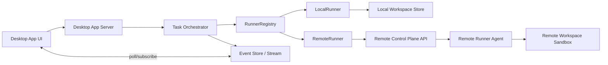

# 멀티 워크스페이스 / 원격 실행 러너 설계

## 배경

현재 Desktop App 실행 모델은 로컬 저장소에 고정되어 있습니다.

- 태스크별/에이전트별 분리는 로컬 `git worktree`로 처리합니다.
- 실행 프로세스는 Desktop App가 직접 생성/관리합니다.
- 상태 수집은 로컬 PID/포트 스캔(`lsof`) 기반입니다.

이 구조는 단일 사용자/단일 머신에서는 단순하지만, 다음 요구를 만족하기 어렵습니다.

- 여러 워크스페이스를 동시에 장기간 운영
- 원격 머신에서 실행하고 로컬에서는 관제만 수행
- 재시작/네트워크 단절 이후에도 실행 상태를 일관되게 복구

## 목표

1. **워크스페이스 격리 강화**: 저장소, 브랜치, 실행 컨텍스트를 워크스페이스 단위로 명확히 분리.
2. **원격 실행 표준화**: 로컬/원격을 같은 계약으로 다루는 Runner 추상화 도입.
3. **복구 가능성 확보**: 프로세스 재시작/에이전트 장애/네트워크 오류에 대한 상태 모델 정의.
4. **점진적 도입**: 기존 로컬 실행 기능을 유지하면서 원격 실행을 단계적으로 확장.

## 비목표

- 첫 단계에서 쿠버네티스 같은 오케스트레이터 통합을 강제하지 않음.
- 모든 에이전트 프로토콜을 즉시 단일화하지 않음(어댑터 허용).
- 완전한 멀티테넌시 보안 경계를 단번에 구현하지 않음.

## 용어

- **Workspace**: 특정 저장소 + 기준 브랜치 + 실행 정책을 담는 상위 컨테이너.
- **TaskRun**: 사용자가 만든 단일 작업 실행 요청.
- **AgentRun**: TaskRun 내부에서 에이전트별로 fan-out 된 실행 단위.
- **Runner**: AgentRun을 실제로 실행/중지/상태조회하는 구현체(로컬/원격).

## 제안 아키텍처



### 핵심 포인트

- Orchestrator는 Runner 타입을 모른 채 계약 인터페이스만 호출합니다.
- `RunnerRegistry`가 워크스페이스 정책(`local`, `remote`)으로 구현체를 선택합니다.
- 실행 상태는 Runner 내부 메모리가 아니라 Event Store 중심으로 기록합니다.

## Runner 계약

```kotlin
interface Runner {
  fun start(run: AgentRunSpec): RunnerHandle
  fun stop(handle: RunnerHandle, reason: StopReason)
  fun getStatus(handle: RunnerHandle): RunnerStatus
  fun streamEvents(handle: RunnerHandle): Flow<RunnerEvent>
}
```

### 상태 모델

- `PENDING` → `PREPARING` → `RUNNING` → (`SUCCEEDED` | `FAILED` | `CANCELED`)
- `UNKNOWN`: 원격 연결 단절 등으로 최신 상태를 확정하지 못한 경우
- `RECOVERING`: 재연결/재동기화 시도 중인 과도 상태

## 실행 라이프사이클

1. TaskRun 생성 시 워크스페이스 정책으로 Runner 타입 결정.
2. AgentRun별로 `start` 호출, `RunnerHandle` 저장.
3. Runner 이벤트를 Orchestrator/Event Store에 append.
4. UI는 Event Store를 구독해서 실시간 상태 반영.
5. 중단/재시도 시 기존 `RunnerHandle` 조회 후 `stop`/`start` 수행.
6. 프로세스 재시작 시 Event Store + Runner `getStatus`로 상태 재구성.

## 워크스페이스 격리 모델

### 공통 원칙

- 워크스페이스 루트 경로를 고정된 ID로 매핑(`workspace/<workspace-id>`).
- TaskRun/AgentRun 산출물은 워크스페이스 경계 밖으로 쓰기 금지.
- 실행 환경 변수는 allow-list 기반으로 주입.

### 로컬 실행

- 기존 `.cotor/worktrees/<task-id>/<agent-name>` 모델을 유지.
- 단, 워크스페이스 메타데이터에 base branch, runner type, 정책 버전 저장.

### 원격 실행

- 원격 러너 에이전트는 워크스페이스마다 전용 sandbox 디렉터리 사용.
- Git clone/fetch/checkout은 원격에서 수행하고, 결과 메타만 서버로 보고.
- 아티팩트는 압축 업로드 또는 객체 스토리지 링크로 수집.

## 원격 러너 책임

1. 실행 요청 인증/인가 토큰 검증
2. 워크스페이스 준비(clone/fetch/checkout/worktree)
3. 에이전트 프로세스 실행 및 표준 출력/오류 수집
4. heartbeats + 상태 이벤트 전송
5. 취소 신호 처리(SIGTERM→유예→SIGKILL)
6. 정리 정책(TTL 기반 로그/임시파일 정리)

## 장애/복구 전략

- **네트워크 단절**: 일정 시간 heartbeat 누락 시 `UNKNOWN` 전환.
- **에이전트 크래시**: exit code와 마지막 stderr를 이벤트에 함께 기록.
- **서버 재시작**: `RECOVERING`으로 시작해 원격 `getStatus` 재동기화.
- **중복 실행 방지**: `runId + agentName` 멱등 키로 start 요청 보호.

## 보안 및 경계

- 원격 제어 평면은 mTLS 또는 서명 토큰 기반 인증.
- Runner별 최소 권한 원칙(읽기 전용 토큰, 제한된 디렉터리 접근).
- 로그/아티팩트에서 토큰/비밀값 마스킹.
- 워크스페이스 간 파일 시스템 공유 금지.

## 현재 코드베이스 통합 지점

- `DesktopAppService`: TaskRun 생성/조회 API에 runner policy 필드 추가.
- `GitWorkspaceService`: workspace 메타데이터 구조를 runner-aware 형태로 확장.
- `TaskOrchestrator`: 프로세스 직접 제어 대신 Runner 인터페이스 호출로 전환.
- `docs/FEATURES.md` 및 앱 설정 화면: 로컬/원격 실행 모드 노출.

## 단계별 구현 계획

### Phase 1: 추상화 도입 (로컬 동작 유지)

- Runner 인터페이스 + LocalRunner 구현.
- 기존 실행 경로를 LocalRunner 호출로 리팩터링.
- Event Store를 실행 상태의 source of truth로 전환.

### Phase 2: 원격 제어 평면 최소 기능

- RemoteRunner + Remote Runner Agent 프로토콜 정의.
- start/stop/status + heartbeat까지 지원.
- 단일 원격 호스트 대상으로 E2E 검증.

### Phase 3: 운영 기능 강화

- 재시도 정책, 쿼터, 동시성 제한.
- 아티팩트 수집/보관 정책.
- 관측성(메트릭/추적)과 운영 대시보드 확장.

## 검증 전략

- 계약 테스트: Runner 공통 테스트 스위트(Local/Remote 공용).
- 장애 주입 테스트: heartbeat 중단, 네트워크 지연, 강제 종료.
- 회귀 테스트: 기존 로컬 멀티 에이전트 실행 흐름 동일성 확인.
- 문서 검증: 아키텍처/데스크톱 문서에서 설계 링크 탐색 가능해야 함.

## 오픈 이슈

- 원격 실행 환경의 표준 이미지/런타임 버전 관리 방식
- 대규모 로그 스트리밍(backpressure) 처리 전략
- 조직/사용자 단위 멀티테넌시 정책 적용 시점
