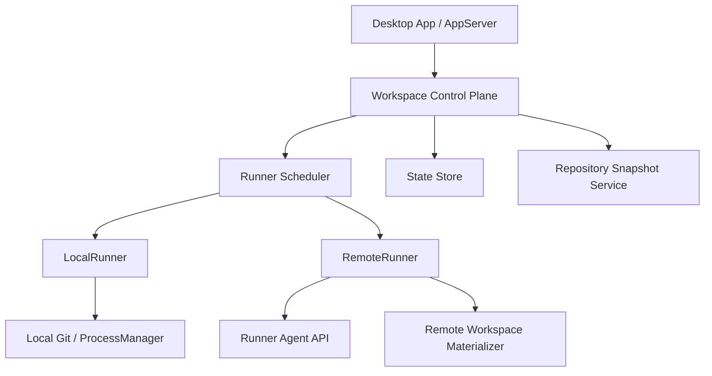
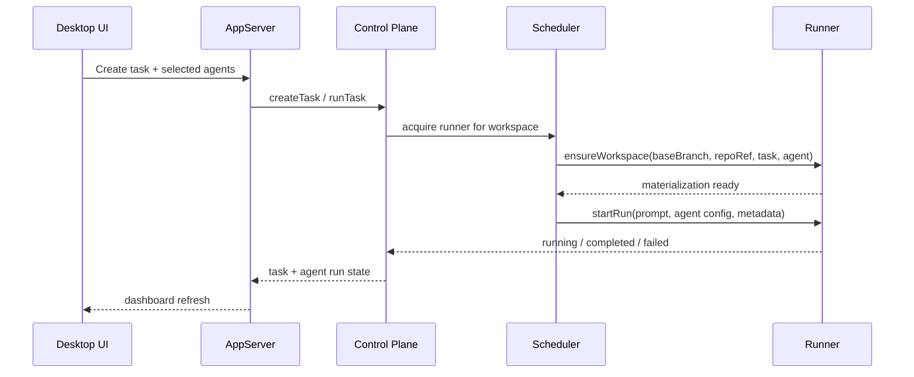

# 멀티워크스페이스 / 원격실행 러너 설계

상태: Draft
관련 이슈: `HEO-68`
최종 업데이트: 2026-03-11

## 1. 배경

현재 데스크톱 실행 모델은 "로컬 저장소 + 로컬 git worktree + 로컬 프로세스 실행"에 강하게 결합되어 있다.

- `DesktopAppService`는 태스크를 fan-out 하고 각 에이전트 실행마다 worktree를 준비한다.
- `GitWorkspaceService`는 브랜치 선택, worktree 생성, 파일 트리 조회, diff 생성, 포트 조회까지 모두 로컬 파일시스템 기준으로 수행한다.
- `AgentExecutionMetadata`와 `ExecutionContext`는 `workingDirectory`를 핵심 격리 단위로 사용한다.
- `ProcessManager`와 플러그인 실행은 현재 머신에서 직접 child process를 띄우는 구조다.

이 구조는 첫 번째 macOS 데스크톱 릴리스에는 적합하지만, 다음 요구사항을 만족시키기 어렵다.

- 동일 리포지토리에 대해 여러 베이스 브랜치 / 여러 작업공간을 동시에 안정적으로 운영
- 로컬 머신이 아닌 별도 실행 호스트에서 agent run 수행
- 실행 자원 분산, 격리 강화, 재시도/복구 표준화
- 향후 Linux/macOS 혼합 러너 또는 ephemeral runner 확장

## 2. 문제 정의

현재 구조에서는 "컨트롤 플레인"과 "실행 플레인"이 사실상 하나의 서비스에 섞여 있다.

- `Workspace`는 `repositoryId + baseBranch`만 표현하며 실행 위치를 표현하지 못한다.
- `AgentRun`은 `worktreePath`, `processId` 중심이라 원격 실행, lease, materialization 상태를 기록할 수 없다.
- `AppServer` API는 로컬 경로와 로컬 프로세스 조회를 전제로 한다.
- 인터랙티브 TUI 세션도 로컬 PTY 세션에 직접 묶여 있다.

결과적으로 현재 모델은 "여러 workspace를 어디서 materialize 하고 누가 실행하는가"를 추적할 수 없다.

## 3. 목표

1. 기존 로컬 worktree 실행을 하나의 러너 구현으로 재정의한다.
2. Workspace와 AgentRun이 실행 위치, 동기화 상태, lease 상태를 표현하도록 모델을 확장한다.
3. `DesktopAppService`를 컨트롤 플레인으로, 러너 구현체를 실행 플레인으로 분리한다.
4. 원격 러너를 도입해도 기존 데스크톱 UX가 크게 바뀌지 않도록 API 호환성을 유지한다.
5. 실패/재시도/취소/상태 조회를 러너 공통 계약으로 정리한다.

## 4. 비목표

- 이번 설계에서 인터랙티브 TUI 원격화까지 즉시 구현하지 않는다.
- GitHub Actions 같은 외부 CI 러너와의 직접 통합 세부사항은 포함하지 않는다.
- 아티팩트 저장소의 구체 벤더 선택(S3, MinIO 등)은 결정하지 않는다.
- 다중 사용자 권한 모델 및 조직 단위 스케줄링까지 확장하지 않는다.

## 5. 현재 기준선

현재 시스템이 이미 제공하는 안정적인 기준은 다음과 같다.

- 리포지토리 등록과 기본 브랜치 탐지
- workspace 생성 시 base branch 고정
- 태스크당 에이전트 fan-out
- 에이전트별 브랜치 `codex/cotor/<task-slug>/<agent-name>`
- 에이전트별 worktree `.cotor/worktrees/<task-id>/<agent-name>`
- diff / files / ports / run 상태 조회

새 설계는 이 기준선을 깨지 않고 "로컬 실행"을 하나의 `LocalRunner` 구현으로 끌어내리는 방향이어야 한다.

## 6. 제안 아키텍처

### 6.1 레이어 분리



### 6.2 핵심 원칙

- 컨트롤 플레인은 workspace와 task를 생성하고 스케줄링만 담당한다.
- 러너는 workspace materialization, process launch, stdout/stderr 수집, 포트/상태 보고를 담당한다.
- 로컬 러너와 원격 러너는 동일한 `RunnerAdapter` 계약을 따른다.
- UI는 로컬 경로 대신 "workspace materialization"과 "run endpoint"를 읽는다.

## 7. 도메인 모델 변경안

### 7.1 신규 개념

- `Runner`
  실행 호스트 한 대 또는 한 풀의 논리 단위
- `RunnerCapability`
  OS, CPU, 네트워크 정책, 지원 agent, max concurrency
- `WorkspaceMaterialization`
  특정 workspace가 특정 runner에 checkout/sync 된 실제 작업 디렉토리
- `RunLease`
  특정 run이 runner 슬롯을 점유한 상태

### 7.2 모델 확장

#### `Workspace`

기존:

- `id`
- `repositoryId`
- `name`
- `baseBranch`

제안:

- `executionMode: LOCAL | REMOTE | HYBRID`
- `preferredRunnerId: String?`
- `materializationStrategy: BRANCH_WORKTREE | MIRROR_CLONE | ARCHIVE_SYNC`
- `lastMaterializedAt: Long?`

#### `AgentRun`

기존:

- `branchName`
- `worktreePath`
- `processId`

제안:

- `runnerId: String?`
- `runnerKind: LOCAL | REMOTE`
- `workspacePathHint: String?`
- `leaseId: String?`
- `queueStartedAt: Long?`
- `startedAt: Long?`
- `completedAt: Long?`
- `syncStatus: PENDING | MATERIALIZING | READY | DIRTY | FAILED`
- `artifactRef: String?`
- `portBindings: List<PortBinding>`

### 7.3 호환성 원칙

- `worktreePath`는 당분간 유지하되 UI 힌트 필드로 강등한다.
- 로컬 실행에서는 `runnerId = "local"` 같은 예약값으로 기존 동작을 흡수한다.
- 기존 API 소비자는 `runnerId`를 무시해도 동작해야 한다.

## 8. 러너 계약

컨트롤 플레인과 러너 사이에는 최소한 아래 계약이 필요하다.

```kotlin
interface RunnerAdapter {
    suspend fun ensureWorkspace(request: EnsureWorkspaceRequest): WorkspaceMaterialization
    suspend fun startRun(request: StartRunRequest): StartedRun
    suspend fun getRun(runId: String): RunnerRunSnapshot
    suspend fun cancelRun(runId: String)
    suspend fun listPorts(runId: String): List<PortEntry>
    suspend fun collectArtifacts(runId: String): RunnerArtifacts
}
```

### 8.1 `LocalRunner`

- 현재 `GitWorkspaceService` + `ProcessManager` 조합을 감싸는 구현
- `ensureWorktree()`는 `ensureWorkspace()`로 승격
- 파일 조회, diff 조회, 포트 조회는 로컬 filesystem/`lsof` 기반 유지

### 8.2 `RemoteRunner`

- 러너 에이전트 API와 통신
- workspace를 원격 호스트에 materialize
- run 상태를 polling 또는 event stream으로 수집
- 필요 시 산출물(diff, logs, metadata)을 아티팩트 저장소에 업로드

## 9. Workspace materialization 전략

원격 실행에서는 "리포지토리를 어떻게 runner에 준비할 것인가"가 핵심이다.

### 9.1 후보 전략

1. `BRANCH_WORKTREE`
   중앙 bare clone 또는 long-lived checkout 위에 worktree를 생성
2. `MIRROR_CLONE`
   runner별 mirror clone 유지 후 branch checkout
3. `ARCHIVE_SYNC`
   특정 commit snapshot을 압축해 전송 후 원격에서 branch 생성

### 9.2 권장안

초기 원격 러너는 `MIRROR_CLONE`을 기본으로 한다.

- 로컬 worktree 모델과 개념이 가장 가깝다.
- git diff / branch 생성 / 재실행 재현성이 높다.
- 전체 저장소를 매번 전송하는 `ARCHIVE_SYNC`보다 재시작 비용이 낮다.

`ARCHIVE_SYNC`는 폐쇄망 또는 git credential 위임이 어려운 환경의 차선책으로 남긴다.

## 10. 실행 시퀀스



### 10.1 세부 단계

1. 사용자가 workspace를 선택하고 task를 생성한다.
2. 컨트롤 플레인이 각 agent run에 대해 러너를 할당한다.
3. 러너는 해당 workspace의 base branch 기준 materialization을 준비한다.
4. 컨트롤 플레인은 branch naming 정책을 전달한다.
5. 러너는 실행 시작 후 `runId`, pid 대체 식별자, 로그 스트림 핸들을 반환한다.
6. 완료 후 diff, changed files, output, ports, artifact reference를 보고한다.

## 11. 스케줄링 및 lease

러너를 여러 대 운영하려면 단순 fan-out 대신 lease가 필요하다.

- 러너별 `maxConcurrentRuns`
- workspace materialization 재사용 가능 여부
- 동일 repository/baseBranch 조합의 cache affinity
- agent capability 매칭

권장 정책:

- 기본은 `least-loaded`
- 같은 workspace 재실행은 `sticky runner`
- long-running run timeout 및 zombie lease reaper 제공

## 12. API 변경 방향

`AppServer`는 기존 엔드포인트를 유지하되 응답을 runner-aware 하게 확장한다.

### 12.1 유지할 엔드포인트

- `/api/app/workspaces`
- `/api/app/tasks`
- `/api/app/runs`
- `/api/app/changes`
- `/api/app/files`
- `/api/app/ports`

### 12.2 응답 확장

- `Workspace` 응답에 `executionMode`, `preferredRunnerId`
- `AgentRun` 응답에 `runnerId`, `syncStatus`, `workspacePathHint`
- `changes/files/ports` 조회 실패 시 "원격 materialization 미준비"를 명시하는 에러 코드

### 12.3 신규 엔드포인트 후보

- `GET /api/app/runners`
- `POST /api/app/runners/{runnerId}/drain`
- `POST /api/app/workspaces/{workspaceId}/materialize`

## 13. 보안 및 격리

원격 러너 도입 시 보안 경계는 지금보다 명시적이어야 한다.

- runner credential은 데스크톱 앱이 아니라 backend/app-server 또는 별도 control-plane secret store가 소유
- workspace materialization 경로는 사용자 입력으로 직접 노출하지 않음
- run 요청은 허용된 agent/plugin 조합만 수락
- 로그/산출물 업로드 시 secret redaction 규칙 적용
- runner 등록은 mTLS 또는 signed token 기반 권장

## 14. 장애 처리

### 14.1 실패 유형

- workspace materialization 실패
- runner 할당 실패
- run launch 실패
- 네트워크 단절로 인한 상태 미확정
- artifact 수집 실패

### 14.2 원칙

- `syncStatus`와 `run status`를 분리해 표시한다.
- 원격 상태가 불명확하면 즉시 `FAILED`로 덮어쓰지 않고 `UNKNOWN` 또는 `LOST`를 고려한다.
- 컨트롤 플레인은 idempotent 재조회와 재수집을 지원해야 한다.
- branch/workspace cleanup는 best-effort 비동기 작업으로 분리한다.

## 15. 인터랙티브 TUI 범위

인터랙티브 TUI는 배치 runner와 분리해서 다뤄야 한다.

- 현재는 `DesktopTuiSessionService`가 로컬 PTY에 직접 결합
- 원격 TUI는 별도 전송 계층(pty stream, resize, input ack)이 필요
- 따라서 1차 설계 범위에서는 batch/task run만 원격화하고 TUI는 로컬 유지

## 16. 단계별 도입 계획

### Phase 1. 내부 추상화

- `RunnerAdapter` 도입
- `GitWorkspaceService`를 `LocalRunner` 성격으로 재구성
- `Workspace`, `AgentRun` 모델 확장

### Phase 2. 러너 인식 UI/API

- 대시보드 응답에 runner metadata 추가
- run 상세 화면에 sync/runner 상태 노출
- 오류 메시지를 local-path 중심에서 runner-state 중심으로 변경

### Phase 3. 단일 원격 러너

- 하나의 remote runner 구현 추가
- mirror clone 기반 materialization
- polling 기반 run 상태 수집

### Phase 4. 다중 러너 스케줄링

- runner capability/lease/scheduler
- sticky workspace placement
- drain/maintenance 모드

## 17. 검증 전략

### 17.1 설계 검증

- 현재 코드 기준으로 local-only 결합 지점을 모두 설명하는지 검토
- API, 모델, 실행 흐름, 실패 모델이 서로 모순되지 않는지 검토

### 17.2 구현 시 테스트 권장안

- `DesktopAppService` 단위 테스트:
  runner 선택, queued/running/completed 상태 전이
- `LocalRunner` 단위 테스트:
  worktree 재사용, branch naming, diff/files/ports 조회
- `RemoteRunner` 계약 테스트:
  materialize/startRun/getRun/cancelRun/collectArtifacts
- AppServer API 테스트:
  runner-aware JSON 응답 스냅샷

## 18. 오픈 질문

- 원격 러너가 git credential을 직접 가져야 하는가, 아니면 snapshot 전달만 허용할 것인가
- 변경 diff를 항상 git 기준으로 계산할지, artifact manifest와 병행할지
- 원격 run의 browser/port 미리보기는 reverse proxy로 제공할지, signed local tunnel로 제공할지
- runner health/state를 state file에 둘지 별도 registry로 둘지

## 19. 결론

현재 시스템은 이미 "workspace 기반 fan-out 실행"의 골격을 갖고 있지만, 그 골격이 로컬 filesystem과 로컬 process에 직접 결합되어 있다.

따라서 구현의 핵심은 새 기능을 덧붙이는 것이 아니라 다음 분리를 먼저 만드는 것이다.

1. `DesktopAppService`를 컨트롤 플레인으로 고정
2. `GitWorkspaceService + ProcessManager`를 `LocalRunner`로 축소
3. `Workspace`와 `AgentRun`을 runner-aware 모델로 확장
4. 그 위에 `RemoteRunner`와 scheduler를 추가

이 순서를 따르면 기존 macOS 데스크톱 UX를 유지하면서도 멀티워크스페이스/원격실행 러너를 무리 없이 확장할 수 있다.
