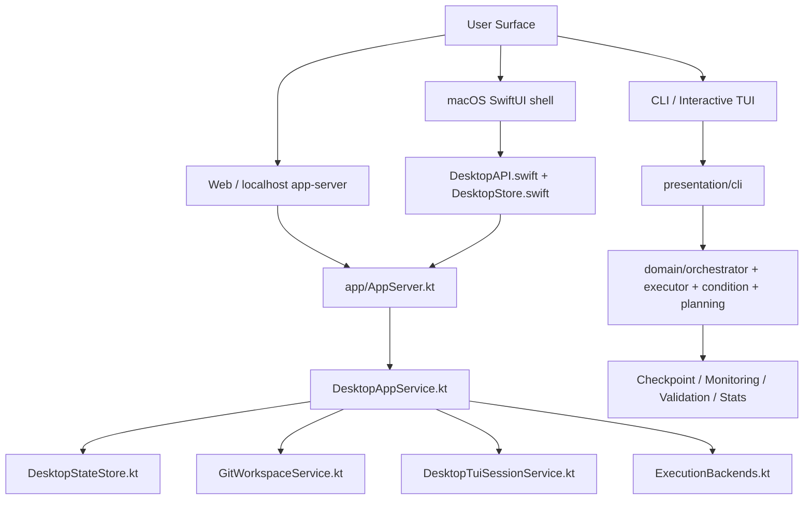
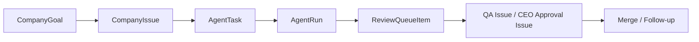

# Cotor 코드베이스 정밀 해설

이 문서는 Cotor를 `문서 설명`이 아니라 `실제 구현 코드` 기준으로 읽은 결과를 정리한 것이다.  
대상 범위는 현재 저장소에 존재하는 Kotlin core, localhost `app-server`, macOS desktop shell, 그리고 company workflow 레이어다.

## 1. 한 줄 모델

- Cotor의 실체는 `공유 Kotlin 런타임`이다.
- CLI/TUI, YAML pipeline 실행기, localhost `app-server`, 그리고 macOS desktop은 이 코어를 서로 다른 표면으로 노출한다.
- desktop app은 별도 백엔드가 아니라 `SwiftUI shell + localhost HTTP client`, 실제 상태 변화와 실행은 Kotlin app layer가 담당한다.
- `Company`와 `TUI`는 desktop에서 공존하지만 역할이 다르다.
  - `Company`: 목표, 이슈, 리뷰, 런타임, follow-up이 얽힌 운영 콘솔
  - `TUI`: 폴더/워크스페이스에 붙는 독립 interactive terminal

## 2. 저장소 전체 레이어 맵

### 실제 진입 파일

- CLI 진입: `src/main/kotlin/com/cotor/Main.kt`
- CLI 명령 표면: `src/main/kotlin/com/cotor/presentation/cli/Commands.kt`
- 실제 `run/validate/test` 등록: `src/main/kotlin/com/cotor/presentation/cli/EnhancedCommands.kt`
- interactive TUI: `src/main/kotlin/com/cotor/presentation/cli/InteractiveCommand.kt`
- localhost API: `src/main/kotlin/com/cotor/app/AppServer.kt`
- app service/state 모델: `src/main/kotlin/com/cotor/app/DesktopAppService.kt`, `src/main/kotlin/com/cotor/app/DesktopModels.kt`, `src/main/kotlin/com/cotor/app/DesktopStateStore.kt`
- desktop TUI runtime: `src/main/kotlin/com/cotor/app/DesktopTuiSessionService.kt`
- git/worktree/PR: `src/main/kotlin/com/cotor/app/GitWorkspaceService.kt`
- Swift shell: `macos/Sources/CotorDesktopApp/DesktopStore.swift`, `DesktopAPI.swift`, `Models.swift`, `ContentView.swift`

## 3. CLI / Interactive / Pipeline 실행 흐름

### 3.1 `cotor` 엔트리포인트

`Main.kt`가 첫 분기점이다.

- 인자 없음: `InteractiveCommand().main(emptyArray())`
- 첫 인자가 `tui`: `InteractiveCommand` alias
- 알려진 명령이면 full CLI (`CotorCli().subcommands(...)`)
- 모르는 첫 인자면 direct pipeline fallback으로 `SimpleCLI().run(args)`

중요한 점:

- `Commands.kt` 안에 `RunCommand`가 있지만, 실제 `Main.kt`에 등록된 것은 `EnhancedRunCommand`다.
- 즉 현재 명령 표면의 실체는 `Commands.kt + EnhancedCommands.kt`의 혼합이다.

### 3.2 interactive 모드의 실제 성격

`InteractiveCommand.kt`는 YAML pipeline을 경유하지 않고 configured agent를 직접 때리는 terminal chat loop다.

- 옵션 축
  - `--mode auto|single|compare`
  - `--agent`
  - `--agents`
  - `--save-dir`
  - `--prompt`
- 기본 동작
  - preferred agent를 하나 골라 `single`처럼 동작
  - transcript와 memory를 `ChatTranscriptWriter`로 기록
  - `interactive.log`를 함께 남김
- desktop TUI 입력 보정
  - `normalizeInteractiveInput(...)`가 `you> :help` 같은 echoed prompt prefix를 제거

### 3.3 interactive 결과 저장

`InteractiveCommand.kt`는 turn마다 다음을 기록한다.

- `transcript.md`
- `transcript.txt`
- `jsonl`
- `interactive.log`

즉 interactive는 단순 REPL이 아니라, transcript/memory/log가 붙은 session 기록 시스템이다.

### 3.4 pipeline 오케스트레이터의 실제 구조

`PipelineOrchestrator.kt`의 `DefaultPipelineOrchestrator.executePipeline(...)`가 모든 execution mode의 단일 입구다.

여기서 먼저 수행하는 일:

1. execution mode와 stage type 호환성 검사
2. template validation
3. `PipelineContext` 생성
4. observability trace 연결
5. mode별 executor 분기
   - `executeSequential`
   - `executeParallel`
   - `executeDag`
   - `executeMap`
6. 결과 집계, stats 기록, checkpoint 저장

### 3.5 execution mode별 성격

- `SEQUENTIAL`
  - 유일하게 conditional stage와 loop stage를 지원
  - mutable index 기반으로 `goto`, `loop`, skip 처리
- `PARALLEL`
  - execution stage만 허용
  - conditional/loop stage는 금지
- `DAG`
  - author order가 아니라 dependency/topological order로 실행
  - 그래도 stage 실행 자체는 순차적으로 정리됨
- `MAP`
  - 동일 pipeline definition을 map input에 대해 반복 적용하는 확장 모드

### 3.6 templating / condition / checkpoint 결합점

- templating: `TemplateEngine`, `PipelineTemplateValidator`
- condition: `ConditionEvaluator`
- recovery/checkpoint: `CheckpointManager`, `toCheckpoint`
- execution: `AgentExecutor`
- aggregation: `ResultAggregator`
- stats: `StatsManager`

즉 pipeline core는 "agent 호출기" 단일 컴포넌트가 아니라, validation/template/condition/checkpoint/stats가 붙은 coordinator다.

## 4. app-server와 desktop 경계

### 4.1 `AppServer.kt`의 역할

`AppServer`는 localhost-only Ktor 서버다.

- bind: 기본 `127.0.0.1:8787`
- 인스턴스 락: `DesktopAppServerInstanceGuard`
- health/ready probe는 무인증
- 나머지 `/api/app/**`는 optional bearer token 보호
- app 종료 시
  - `DesktopTuiSessionService.shutdown()`
  - `DesktopAppService.shutdown()`
  - instance lock 해제

### 4.2 `/api/app` 라우트 그룹

실제 라우트는 `AppServer.kt`에 평평하게 많지만, 의미상 아래처럼 묶인다.

#### Bootstrap / settings

- `/api/app/dashboard`
- `/api/app/settings`
- `/api/app/settings/backends`
- `/api/app/settings/backends/default`
- `/api/app/settings/backends/test`
- `/api/app/agents`

#### Repository / workspace / task / run

- `/api/app/repositories`
- `/api/app/workspaces`
- `/api/app/tasks`
- `/api/app/runs`
- `/api/app/changes`
- `/api/app/files`
- `/api/app/ports`

#### Legacy goal/issue/review/runtime surface

- `/api/app/goals`
- `/api/app/company`
- `/api/app/company/goals`
- `/api/app/company/issues`
- `/api/app/company/review-queue`
- `/api/app/company/runtime`

#### Current company-scoped surface

- `/api/app/companies`
- `/api/app/companies/{companyId}/dashboard`
- `/api/app/companies/{companyId}/goals`
- `/api/app/companies/{companyId}/issues`
- `/api/app/companies/{companyId}/review-queue`
- `/api/app/companies/{companyId}/activity`
- `/api/app/companies/{companyId}/events`
- `/api/app/companies/{companyId}/topology`
- `/api/app/companies/{companyId}/decisions`
- `/api/app/companies/{companyId}/contexts`
- `/api/app/companies/{companyId}/pipelines`
- `/api/app/companies/{companyId}/context-entries`
- `/api/app/companies/{companyId}/messages`
- `/api/app/companies/{companyId}/execution-log`
- `/api/app/companies/{companyId}/issue-graph`
- `/api/app/companies/{companyId}/budget`
- `/api/app/companies/{companyId}/runtime`

#### TUI terminal surface

- `/api/app/tui/sessions`
- `/api/app/tui/sessions/{sessionId}`
- `/api/app/tui/sessions/{sessionId}/delta`
- `/api/app/tui/sessions/{sessionId}/input`
- `/api/app/tui/sessions/{sessionId}/terminate`

중요한 관찰:

- route surface는 "새 company-scoped API"와 "legacy convenience API"가 동시에 존재한다.
- macOS client는 점점 `/api/app/companies/{companyId}/...` 쪽으로 이동하고 있다.

## 5. desktop 상태의 실제 소유권

### 5.1 영속 상태는 Kotlin이 가진다

`DesktopStateStore.kt`가 실제 persisted state owner다.

- 파일 위치: `appHome/state.json`
- 백업: `state.json.bak`
- 락: `state.lock`
- 특징
  - decode 실패 시 empty fallback
  - backup restore
  - lenient decode
  - oversized prompt/output compacting
  - legacy runtime normalization

즉 state store는 단순 JSON writer가 아니라, desktop가 죽지 않도록 state 복구/축약/정규화까지 책임진다.

### 5.2 메모리 상태와 사용자 선택은 Swift가 가진다

`DesktopStore.swift`는 macOS shell의 in-memory view model이다.

- bootstrap
  - `bootstrap()`
  - `refreshDashboard()`
  - `refreshFullDashboard()`
  - `refreshCompanyDashboard()`
- shell mode 전환
  - `setShellMode(_:)`
- company live update
  - `restartCompanyEventStream()`
  - `startCompanyStatePolling()`
  - `startEmbeddedBackendWatchdog()`
- TUI
  - `ensureTuiSession(...)`
  - `launchTuiSession()`
  - `selectTuiSession(_:)`
  - `restartTuiSession()`
  - `startTuiPolling(...)`
  - `recoverFromStaleTuiSession(...)`

정리하면:

- `DesktopAppService`가 사실 상태를 만들고 저장한다.
- `DesktopStore.swift`는 그 상태를 가져와 selection/refresh/recovery/UI intent를 관리한다.

## 6. Kotlin ↔ Swift 계약표

| Kotlin | Swift | 의미 |
| --- | --- | --- |
| `DashboardResponse` / `DesktopAppState` 기반 응답 | `DashboardPayload` | 전체 부트스트랩 상태 |
| `CompanyDashboardResponse` | `CompanyDashboardPayload` | company mode용 focused snapshot |
| `TuiSession` | `TuiSessionRecord` | interactive terminal snapshot |
| `TuiSessionDelta` | `TuiSessionDeltaPayload` | incremental terminal bytes |
| `ChangeSummary` | `ChangeSummaryPayload` | diff inspector 데이터 |
| `DesktopSettings` | `DesktopSettingsPayload` | desktop bootstrap/settings |
| `CompanyGoal` | `GoalRecord` | 목표 |
| `CompanyIssue` | `IssueRecord` | 실행 단위 이슈 |
| `ReviewQueueItem` | `ReviewQueueItemRecord` | PR 리뷰/승인 큐 |
| `CompanyRuntimeSnapshot` | `CompanyRuntimeSnapshotRecord` | 런타임 패널 상태 |

실제로 Swift `Models.swift`는 decode 시 default를 많이 넣는다.  
즉 Kotlin payload 변경 시 Swift 쪽은 "엄격한 schema sync"보다 "관대한 decode" 쪽으로 설계되어 있다.

## 7. Company workflow의 실제 모델

핵심 모델은 `DesktopModels.kt`에 모여 있다.

- `Company`
- `WorkflowPipelineDefinition`
- `WorkflowStageDefinition`
- `CompanyGoal`
- `CompanyIssue`
- `ReviewQueueItem`
- `CompanyRuntimeSnapshot`
- `WorkflowLineageSnapshot`
- `FollowUpContextSnapshot`
- `AgentTask`
- `AgentRun`

### 7.1 상태기계 관점 요약

### 7.2 중요한 연결 키

- goal ↔ issue: `goalId`
- issue ↔ task: `issueId`
- task ↔ run: `taskId`
- issue/run/review lineage: `workflowLineage`
- follow-up root reason: `followUpContext`

### 7.3 lineage가 왜 중요한가

`WorkflowLineageSnapshot`은 한 PR review cycle을 식별한다.

- `lineageId`
- `reviewQueueItemId`
- `executionIssueId`
- `executionTaskId`
- `executionRunId`
- PR number/url
- branch/worktree
- generation

이 구조 때문에 service는 "같은 이슈 제목"보다 "현재 PR lineage"를 진짜 소스로 본다.  
그래서 stale QA/CEO verdict가 새 PR cycle에 섞이는 걸 막을 수 있다.

### 7.4 follow-up이 그냥 새 goal이 아닌 이유

`FollowUpContextSnapshot`은 follow-up goal이 어떤 실패 맥락에서 태어났는지 들고 간다.

- root goal
- trigger issue
- review queue item
- PR number
- failure class
  - `REVIEW_FAILED_CHECKS`
  - `REVIEW_CHANGES_REQUESTED`
  - `MERGE_CONFLICT`
  - `BLOCKED_EXECUTION`

즉 follow-up은 "막연한 후속 작업"이 아니라, 특정 review lineage 실패의 복구 job이다.

## 8. `DesktopAppService.kt`의 실제 책임

이 파일이 app layer의 중심이다. 단순 CRUD service가 아니다.

### 8.1 상태 조립과 조회

- `dashboard()`
- `companyDashboard(companyId)`
- `listRuns(...)`
- `listCompanies()`
- `runtimeStatus(...)`
- `settings()`
- `githubPublishStatus(...)`

### 8.2 company 운영 명령

- `createCompany(...)`
- `createGoal(...)`
- `decomposeGoal(goalId)`
- `createIssue(...)`
- `delegateIssue(issueId)`
- `runIssue(issueId)`
- `mergeReviewQueueItem(itemId)`
- `startCompanyRuntime(companyId)`
- `stopCompanyRuntime(companyId)`

### 8.3 task/run/worktree

- `createTask(...)`
- `runTask(taskId)`
- `getChanges(runId)`
- `listFiles(runId, ...)`
- `listPorts(runId)`

### 8.4 background healing / runtime orchestration

`DesktopAppService.kt`는 runtime tick 중 다음 계열을 수행한다.

- interrupted blocked issue reopen
- workflow lineage repair
- resolved merge conflict reopen
- no-diff existing PR recovery
- stale follow-up goal/issue 정리
- superseded PR cleanup

즉 이 서비스는 `REST controller 뒤 비즈니스 서비스`가 아니라, 사실상 company 운영 엔진이다.

## 9. merge conflict / stale lineage / PR reuse 처리

이 저장소에서 가장 제품 특성이 강한 부분이 여기다.

### 9.1 merge conflict 복구

`DesktopAppService.kt`에는 다음 계열 함수가 별도로 있다.

- `reopenResolvedMergeConflictIssues(...)`
- `reopenNoOpPullRequestExecutionIssues(...)`
- interrupted blocked issue 복구

의도:

- merge conflict가 풀리면 approval lane을 다시 열어준다.
- no-diff remediation이면 새 PR을 만들지 않고 기존 PR lineage를 재사용한다.
- stale CEO blocker를 execution으로 되밀어 rebase/republish를 유도한다.

### 9.2 stale review lineage 치유

service는 QA/CEO queue, review issue, approval issue, task/run 모두의 `workflowLineage`를 비교해 mismatch를 복구한다.

즉 이 레이어의 불변조건은:

- 최신 execution publish만 현재 review cycle을 대표해야 한다.
- 과거 QA/CEO verdict가 새 cycle로 전달되면 안 된다.
- approval issue도 current lineage를 adopt하거나 rebuild해야 한다.

## 10. Desktop TUI 세션의 실제 수명주기

`DesktopTuiSessionService.kt`가 책임진다.

### 10.1 생성

`openSession(workspaceId, preferredAgent)`:

1. workspace별 기존 세션 재사용 가능 여부 확인
2. `DesktopStateStore.load()`로 workspace/repository 조회
3. isolated config 생성
4. PTY bridge materialize
5. child JVM으로 `com.cotor.MainKt interactive ...` 실행
6. transcript buffer, stdout/stderr reader, watcher 시작

즉 desktop TUI는 별도 구현이 아니라, 실제 `interactive` CLI를 PTY 안에서 돌린 것이다.

### 10.2 관리

- session registry: in-memory `ConcurrentHashMap`
- workspace ↔ session 매핑도 in-memory
- transcript는 rolling buffer (`MAX_TRANSCRIPT_CHARS`)
- delta API는 cursor 기반 incremental chunk 제공

### 10.3 종료/복구

- `terminateSession(...)`
- `shutdown()`
- Swift `DesktopStore.recoverFromStaleTuiSession(...)`

중요한 점:

- backend restart 뒤 session id가 stale해질 수 있다는 전제를 코드가 직접 다룬다.
- Swift는 404/빈 500을 recoverable로 보고 새 workspace session을 다시 연다.

## 11. Git / Worktree / PR 레이어

`GitWorkspaceService.kt`는 모든 git-aware filesystem operation을 모은 곳이다.

핵심 책임:

- repository root 정규화
- non-git folder bootstrap commit
- clone/open/detect branch/remote
- branch picker용 branch 목록
- task별 isolated worktree 생성
- 기존 PR lineage 재사용 worktree 복원
- diff summary 생성
- file tree listing
- PR merge / base branch sync / stale PR cleanup

### 실제 branch/worktree 전략

- branch 형식: `codex/cotor/<task-slug>-<task-id>/<agent>`
- worktree 위치: `.cotor/worktrees/<taskId>/<agent>`

즉 delegated execution은 branch와 worktree 둘 다 격리된다.

## 12. 핵심 사용자 흐름 3개

### 12.1 CLI에서 pipeline 실행

`Main.main`  
→ `EnhancedRunCommand.run`  
→ config load / agent register  
→ `PipelineOrchestrator.executePipeline(...)`  
→ mode별 stage traversal  
→ aggregate / stats / checkpoint

### 12.2 Desktop에서 company 작업 조회/조작

Swift `DesktopStore.bootstrap()`  
→ `DesktopAPI.dashboard()` 또는 `companyDashboard(companyId)`  
→ `AppServer.kt` route  
→ `DesktopAppService.dashboard()/companyDashboard()`  
→ `DesktopStateStore.load()` + runtime snapshot 조립  
→ Swift selection repair / event stream 연결

### 12.3 Desktop TUI 세션 생성과 복구

Swift `ensureTuiSession()`  
→ `DesktopAPI.openTuiSession(...)`  
→ `DesktopTuiSessionService.openSession(...)`  
→ child JVM `MainKt interactive` 실행  
→ transcript polling / delta  
→ backend restart or stale session  
→ Swift `recoverFromStaleTuiSession(...)`  
→ 새 세션 재생성

## 13. 테스트로 본 보장 범위

### 13.1 app layer

- `AppServerTest`
  - health/ready 무인증
  - bearer auth
  - shutdown
  - TUI session route
  - company runtime route
  - company create/delete route
- `DesktopAppServiceTest`
  - publish metadata 저장
  - publish failure/no-diff 처리
  - validation-only follow-up semantics
  - prompt 정책
  - company workflow 회귀 방지
- `DesktopTuiSessionServiceTest`
  - session listing
  - terminate 후 제거
- `DesktopStateStoreTest`
  - trailing corruption 복구
  - backup restore
  - lenient decode
  - state compacting
- `GitWorkspaceServiceTest`
  - unique branch naming
  - origin base 추적
  - existing PR lineage 재사용
  - git bootstrap
  - publish readiness

### 13.2 pipeline core

- `PipelineOrchestratorConditionalTest`
  - decision/goto
  - loop max-iteration
- `PipelineOrchestratorTemplatingTest`
  - 이전 stage output interpolation
- `PipelineOrchestratorTimeoutTest`
  - pipeline timeout
  - stage timeout with fail/continue
- 추가로
  - `PipelineOrchestratorPropertyTest`
  - `PipelineOrchestratorMapTest`

### 13.3 interactive CLI

- `InteractiveCommandTest`
  - default single preferred agent
  - transcript/log 기록
  - compare/auto 모드
  - failure logging
  - desktop prompt normalization

## 14. 코드 읽기에서 바로 보이는 중요한 사실

1. 현재 명령 표면은 문서보다 약간 더 복합적이다.
- `Commands.kt`와 `EnhancedCommands.kt`가 함께 작동한다.
- `RunCommand`보다 `EnhancedRunCommand`가 실제 등록 엔트리다.

2. company API는 migration 중간 상태다.
- legacy `/company` 계열과 최신 `/companies/{companyId}` 계열이 공존한다.

3. desktop의 진짜 상태 소유자는 Swift가 아니다.
- persisted truth는 Kotlin `DesktopStateStore`
- Swift `DesktopStore`는 view-model/selection/recovery owner

4. company workflow의 핵심은 CRUD가 아니라 lineage healing이다.
- stale QA/CEO verdict 차단
- merge-conflict follow-up 재개
- no-diff existing PR reuse
- superseded PR cleanup

5. desktop TUI는 별도 terminal product가 아니다.
- 실제 `interactive` CLI를 PTY로 감싸서 desktop에 투영한 것이다.

## 15. 상대적으로 덜 강하게 보호되는 영역

- `DesktopAppService.kt`가 매우 크고 책임이 넓다.
  - dashboard 조립
  - company runtime loop
  - workflow healing
  - follow-up synthesis
  - task/run orchestration
- 이 구조는 테스트가 많아도 함수 단위 인지부하가 높다.
- route surface도 legacy/current API가 섞여 있어 계약 단순화 여지가 있다.

## 16. 결론

Cotor는 "파이프라인 러너" 하나로 설명되지 않는다.  
실제 구현은 아래 세 축이 겹쳐진 구조다.

- generic pipeline orchestrator
- desktop-facing local operations platform
- company workflow healing engine

그리고 이 모든 축을 하나로 묶는 중심은 `DesktopAppService.kt`와 `DesktopModels.kt`다.  
CLI/TUI, app-server, macOS shell은 결국 이 상태 모델과 실행 코어를 각기 다른 방식으로 노출하고 있다.
